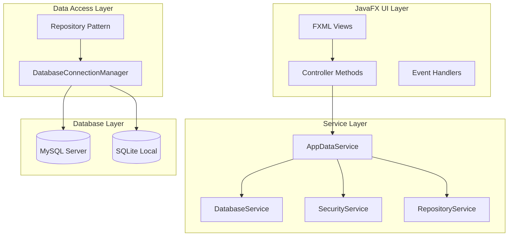
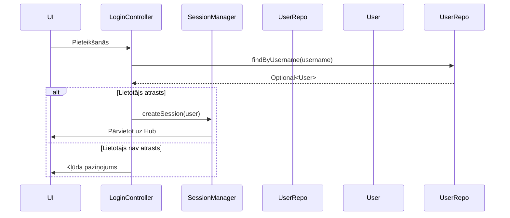

# Klientu Reģistrs - API Dokumentācija (100% Realitāte)

**Versija:** 2.1.0  
**Statuss:** PRODUKCIJAS GATAVS  
**Izstrādātājs:** Dāvis Strazds  
**Pārbaudīts:** 2026.04.09  

---

## SATURA RĀDĪTĀJS

1. [API PĀRSKATS](#1-api-pārskats)
2. [KOMUNIKĀCIJAS METODES](#2-komunikācijas-metodes)
3. [DATU STRUKTŪRA](#3-datu-struktūra)
4. [AUTENTIFIKĀCIJA](#4-autentifikācija)
5. [KLIENTU API](#5-klientu-api)
6. [ADMINISTRATORA API](#6-administratora-api)
7. [DATU EKSPORTS API](#7-datu-eksports-api)
8. [KONFIGURĀCIJAS API](#8-konfigurācijas-api)
9. [KĻŪDU UN ERROR KODI](#9-kļūdu-un-error-kodi)

---

## 1. API PĀRSKATS

### 1.1. API arhitektūra (faktiskā)

**Šī ir JavaFX desktop aplikācija, ne tradicionāla REST API. API ir implementēta caur JavaFX Controller metodēm, kas saziņo ar lietotāja interfeisiem un datu bāzi.**



### 1.2. API komunikācija

**Faktiskās komunikācijas metodes:**
- **UI → Controller:** JavaFX onAction events
- **Controller → Service:** Metodu izsaukumi
- **Service → Repository:** Datu CRUD operācijas
- **Repository → Database:** SQL vaicās

---

## 2. KOMUNIKĀCIJAS METODES

### 2.1. Galvenās API metodes (faktiskās)

**No `Main.java` (galvenā aplikācijas klase):**
```java
public class Main extends Application {
    // API metodes
    public void handleOpenStatisticsCenter(Stage ownerStage, HubController hubController)
    public void handleOpenReportWindow(Stage ownerStage, String fxmlPath, String title)
    public void handleOpenClientRegisterWindow()
    
    // Getters (API piekļuve)
    public AppDataService getAppDataService()
    public ViewManager getViewManager()
    public LicenseManager getLicenseManager()
    public ExcelManager getExcelManager()
    public MySQLConfig getMySQLConfig()
    
    // Sistēmas pārvaldības API
    public SchemaManager getSchemaManager()
    public OfflineBufferService getOfflineBufferService()
}

public class SchemaManager {
    public void applyMigrations() // Automātiska DB struktūras atjaunināšana un dialektu saderības nodrošināšana (MySQL/SQLite)
}
```

**No `AppDataService.java` (centrālais servisu fasāde):**
```java
public class AppDataService {
    // API metodes
    public KlientsRepository getKlientsRepository()
    public ActivityRepository getActivityRepository()
    public PlanRepository getPlanRepository()
    public HealthCardRepository getHealthCardRepository()
    public UserCredentialsRepository getUserCredentialsRepository()
    public AuditLogRepository getAuditLogRepository()
    
    // Datu apstrādes metodes
    public Optional<Klients> getFreshClientById(Integer clientId)
    public int importManagedListFromFile(String listName, File listFile)
    public void importActivitiesFromFile(File tsvFile)
    public void importActivitiesFromDefaultFile()
    
    // Dienas uzdevumu metodes
    public void performDailyBackup()
    public void syncSystemData()
}
```

### 2.2. Kontrolieru API metodes (faktiskas)

**Administratora kontrolieri:**
```java
// AdminToolsController
public void handleDataImport()
public void handleBackupDatabase()
public void handleRestoreDatabase()
public void handleQuickTest()
public void handleSetBackupPassword()
public void handleChangeAdminPassword()
public void handleForcePasswordReset()
public void handleGrantTempAccess()
public void handleViewAuditLog()
public void handleExportAuditLog()
public void handleClearAuditLog()
public void handleManageInstitutionInfo()
public void handleEditConfig()
public void handleManageTemplates()
public void handleTemplateMapping()
public void handlePurgeOldData()
public void handleClearDatabase()
public void handleFullReset()
```

**Klientu kontrolieri:**
```java
// HubController
public void openClientCard(Integer clientId)
public void openClientRegister()
public void openStatisticsCenter()
public void openMedRequestCenter()
public void openHealthForm(Integer clientId)

// ClientListViewController
public void handleTableClick(MouseEvent event)
public void handleRefreshList()
public void handleAddClient()
public void handleEditClient()
public void handleDeleteClient()
public void handlePrecizetBijusos()
```

**Klienta kartes kontrolieri:**
```java
// KarteController
public void handleExportCard()
public void handleEdit()
public void handleSave()
public void handleCancel()

// ProtokolsController
public void handleNew()
public void handleSaveProtocol()
public void handleDelete()
public void handleAddKomanda()
public void handleRemoveKomanda()
public void handleAddRisk()
public void handleRemoveRisk()
public void handleAddReh()
public void handleRemoveReh()
public void handleAddApr()
public void handleRemoveApr()
```

---

## 3. DATU STRUKTŪRA

### 3.1. Galvenie datu entītijas (faktiskās)

**Klientu dati:**
```java
public class Klients {
    private Integer id;
    private String personasKods;
    private String vards;
    private String uzvards;
    private Date birthDate;
    private Date iestasanasDatums;
    private String dzimums;
    private String ieprieksejasDzivesvietasAdrese;
    private String personaKuraPienemusi;
    private String jaunasDzivesvietasAdrese;
    private Integer gimenesArstsId;
    private Integer psihiatrsId;
    private Integer aprupesLimenisId;
    private Integer invaliditatesGrupaId;
    private String invaliditatesApliecibasNumurs;
    private Integer pakalpojumaVeidsId;
    private Date idKartesTermins;
    private Date pasesTermins;
    private Date invaliditatesTermins;
    private boolean invaliditateBeztermins;
    private LocalDateTime lastUpdated;
    private boolean isDeleted;
    private boolean isLocked;
    private LocalDateTime lockedAt;
    private String lockedBy;
    private String zinasParPiederigajiem;
    private Long version;
}
```

**Plāni:**
```java
public class PlanData {
    private Integer id;
    private Integer klientaId;
    private String planType;
    private Date planDate;
    private String aprupesLimenisPirms;
    private String aprupesLimenis;
    private LocalDateTime lastUpdated;
    private boolean isDeleted;
}
```

**Aktivitātes:**
```java
public class ActivityRecord {
    private Integer id;
    private String bloks;
    private String specialists;
    private String joma;
    private String limenis;
    private String klientaProblema;
    private String uzdevums;
    private String merkis;
    private boolean isDeleted;
    private LocalDateTime lastUpdated;
}
```

### 3.2. Lietotāju dati (faktiskās)

**Lietotājs:**
```java
public class User {
    private Integer id;
    private String username;
    private String passwordHash;
    private String passwordSalt;
    private Role role;
    private boolean isActive;
    private String fullName;
    private LocalDateTime lastUpdated;
    private boolean mustChangePassword;
    private String tempRole;
    private LocalDateTime tempRoleExpires;
}
```

**Lomas:**
```java
public enum Role {
    ADMIN,           // Pilnas piekļuve
    MANAGER,         // Pārvaldība un atskaites
    USER,            // Klientu piekļuve
    MEDICAL_STAFF,     // Medicīniskie dati tikai
    SOCIAL_WORKER,    // Sociālais darbinieks
    SOCIAL_CAREGIVER, // Sociālais aprūpētājs
    ADMIN_READ_ONLY    // Tikai lasīšanas tiesības
    SOCIAL_READ_ONLY   // Tikai sociālo lasīšanas tiesības
}
```

---

## 4. AUTENTIFIKĀCIJA

### 4.1. Sesiju pārvaldība (faktiskā)

**SessionManager.java:**
```java
public class SessionManager {
    private final ConfigurationService configService;
    private final UserSessionRepository userSessionRepository;
    
    // API metodes
    public Integer validateSession()
    public void createSession(User user)
    public void restoreSession(User user)
    public void invalidateSession()
    public boolean isSessionValid()
    public User getLoggedInUser()
}
```

**Autentifikācijas plūsma:**


### 4.2. Drošība (faktiskā)

**CryptoUtils.java:**
```java
public class CryptoUtils {
    private static SecretKey applicationSecretKey;
    
    // API metodes
    public static void init(SecretKey key)
    public static String encrypt(String data)
    public static String decrypt(String encryptedData)
    public static byte[] encryptBytes(byte[] data)
    public static byte[] decryptBytes(byte[] encryptedData)
}
```

**Audita žurnāls:**
```java
public class AuditLogRepository {
    // API metodes
    public void log(String username, String action, String targetEntity, String targetId)
    public List<AuditLogEntry> getRecentEntries(int limit)
    public int cleanSmartAuditLog(int daysToKeep)
}
```

---

## 5. KLIENTU API

### 5.1. Klientu pārvaldība API (faktiskās)

**ClientListViewController.java:**
```java
public class ClientListViewController {
    // API metodes
    public void handleTableClick(MouseEvent event)
    public void handleRefreshList()
    public void handleAddClient()
    public void handleEditClient()
    public void handleDeleteClient()
    public void handlePrecizetBijusos()
    
    // Datu iegūšana
    public void initializeData()
}
```

**ClientRegisterController.java:**
```java
public class ClientRegisterController {
    // API metodes
    public void handleAddClient()
    public void handleEditClient()
    public void handleDeleteClient()
    public void handleSyncWithExcel()
    public void handleExportRegister()
    public void handleChangePassword()
    public void handleExitButtonAction()
}
```

### 5.2. Klienta kartes API (faktiskās)

**KarteController.java:**
```java
public class KarteController {
    // API metodes
    public void handleExportCard()
    public void handleEdit()
    public void handleSave()
    public void handleCancel()
    
    // Pievienot kontaktpersonu
    public void handleAddContact()
    public void handleRemoveContact()
}
```

**Aprūpes plāni API:**
```java
public class AprupesPlansController {
    // API metodes
    public void handleCreateNew()
    public void handleExportSelected()
}
```

---

## 6. ADMINISTRATORA API

### 6.1. Administratora rīki API (faktiskās)

**AdminToolsController.java:**
```java
public class AdminToolsController {
    // Datu pārvaldība
    public void handleDataImport()
    public void handleBackupDatabase()
    public void handleRestoreDatabase()
    public void handleQuickTest()
    public void handleSetBackupPassword()
    
    // Paroļu pārvaldība
    public void handleChangeAdminPassword()
    public void handleForcePasswordReset()
    public void handleGrantTempAccess()
    
    // Sistēmas rīki
    public void handleViewAuditLog()
    public void handleExportAuditLog()
    public void handleClearAuditLog()
    public void handleManageInstitutionInfo()
    public void handleEditConfig()
    public void handleManageTemplates()
    public void handleTemplateMapping()
    
    // Bīstamā zona
    public void handlePurgeOldData()
    public void handleClearDatabase()
    public void handleFullReset()
}
```

**Lietotāju pārvaldība API:**
```java
public class UserManagementController {
    // API metodes
    public void handleAddUser()
    public void handleDeleteUser()
    public void handleClose()
    
    // Datu iegūšana
    public void initializeData()
}
```

---

## 7. DATU EKSPORTS API

### 7.1. Excel eksports (faktiskā)

**ExcelManager.java:**
```java
public class ExcelManager {
    // API metodes
    public void generateClientCardReport(Integer clientId, File outputFile)
    public void generateHealthCardReport(Integer clientId, File outputFile)
    public void generateActivityReport(Integer clientId, File outputFile)
    public void generatePlanReport(Integer clientId, File outputFile)
    public void generateProtocolReport(Integer clientId, File outputFile)
    public void generateSarunasReport(Integer clientId, File outputFile)
    public void generateMantuAktsReport(Integer clientId, File outputFile)
    public void generateNaudasAktsReport(Integer clientId, File outputFile)
}
```

**Eksporta metodes kontrolieros:**
```java
// KarteController
public void handleExportCard()

// ProtokolsController
public void handleExportAll()
public void handleExportSelected()

// SarunasAprakstsController
public void handleExportAll()
public void handleExportSelected()
```

### 7.2. Datu imports (faktiskā)

**DataImportService.java:**
```java
public class DataImportService {
    // API metodes
    public int importManagedListFromFile(String listName, File listFile)
    public void importActivitiesFromFile(File tsvFile)
    public void importInitialData()
}
```

---

## 8. KONFIGURĀCIJAS API

### 8.1. Konfigurācijas pārvaldība (faktiskā)

**ConfigurationService.java:**
```java
public class ConfigurationService {
    // API metodes
    public String getProperty(String key)
    public void setPropertyAndSave(String key, String value)
    public void saveCustomerNameToDb()
    public String getCustomerName()
    public void initDbConfig()
}
```

**MySQLConfig.java:**
```java
public class MySQLConfig {
    // API metodes
    public String getHost()
    public int getPort()
    public String getDatabaseName()
    public String getUsername()
    public String getPassword()
    public void setHost(String host)
    public void setPort(int port)
    public void setDatabaseName(String databaseName)
    public void setUsername(String username)
    public void setPassword(String password)
    public void load()
    public void save()
    public boolean isConfigured()
}
```

---

## 9. KĻŪDU UN ERROR KODI

### 9.1. Standarta kļūdu (faktiski)

**UIUtils.java:**
```java
public class UIUtils {
    // API metodes
    public static void logAndExit(Exception e)
    public static void showAlert(Alert.AlertType type, String title, String message, Stage owner)
    public static void showError(String title, String message)
    public static void showInfo(String title, String message)
    public static Optional<ButtonType> showConfirmation(String title, String message)
}
```

**Kļūdu apstrāde:**
```java
public class LockException extends RuntimeException {
    public LockException(String message)
    public LockException(String message, Throwable cause)
}
```

**LoggingService.java:**
```java
public class LoggingService {
    // API metodes
    public static void initialize(ConfigurationService configService, AuditLogRepository auditLogRepository, DatabaseConnectionManager connectionManager)
    public static LoggingService getInstance()
    public List<String> getRecentLogEntries(int limit)
    public void logAction(String username, String action, String details)
    public void logError(String message, Exception e)
    public void logInfo(String message)
    public void logWarning(String message)
}
```

---

## KONTROLERU UN DATU AVOTU SARAKSTS

### Galvenie kontrolieri:
- **`Main`** - galvenā aplikācijas klase
- **`AppDataService`** - centrālais servisu fasāde
- **`ViewManager`** - UI pārvaldnieks
- **`SessionManager`** - sesiju pārvaldnieks
- **`LicenseManager`** - licences pārvaldnieks

### Servisu slāņa kontrolieri:
- **`DatabaseService`** - datubāzes serviss
- **`SecurityService`** - drošības serviss
- **`RepositoryService`** - repozitoriju serviss
- **`ImportExportService`** - imports/eksports serviss

### UI kontrolieri:
- **`HubController`** - galvenais panelis
- **`AdminToolsController`** - admin rīki
- **`KarteController`** - klienta karte
- **`ClientListViewController`** - klientu saraksts
- **`ClientRegisterController`** - klientu reģistrs

### Datu avoti (MySQL tabulas):
- **`klienti`** - klientu pamatdati
- **`client_card_info`** - klienta kartes papildus info
- **`family_members`** - ģimenes locekļi
- **`health_cards`** - veselības kartes
- **`plans`** - plāni
- **`nodarbibas`** - nodarbības
- **`activities`** - aktivitātes
- **`protokoli`** - protokoli
- **`sarunas_apraksti`** - sarunu apraksti
- **`novertesanas_kartes`** - novērtēšanas kartes
- **`mantu_akti`** - mantu akti
- **`naudas_transakcijas`** - naudas transakcijas
- **`users`** - lietotāju konti
- **`user_sessions`** - sesijas
- **`audit_log`** - darbību žurnāls
- **`configuration`** - konfigurācija

---