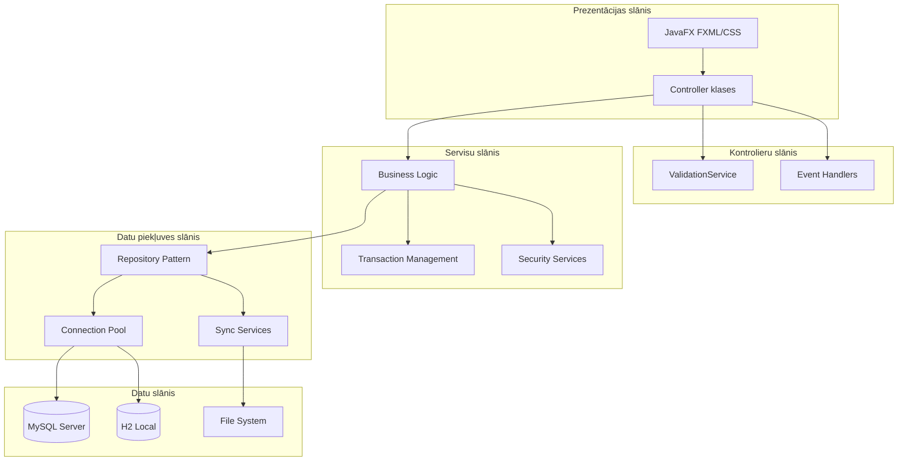
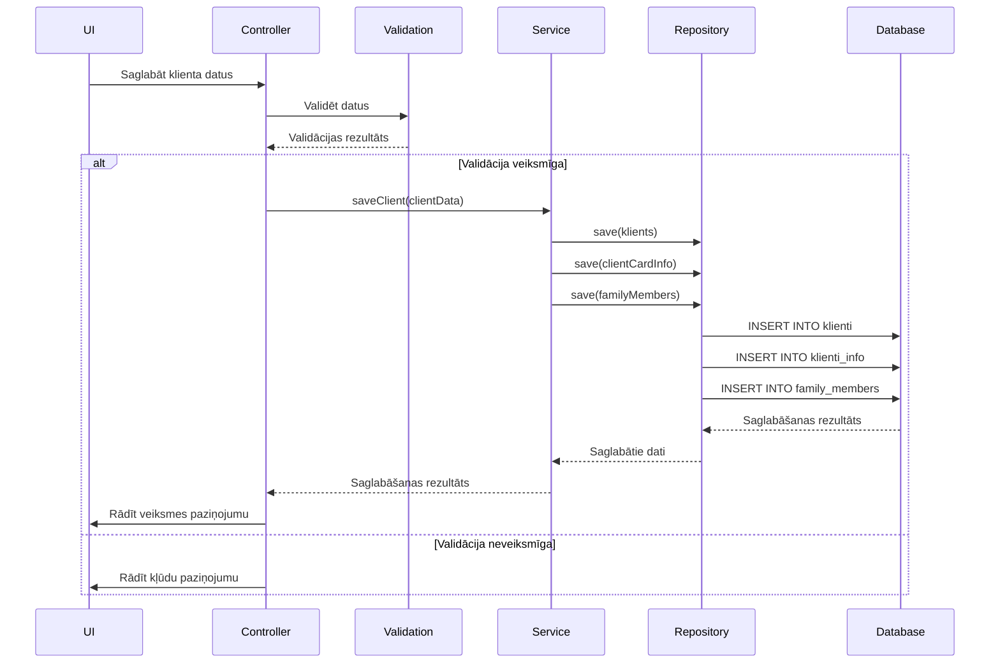
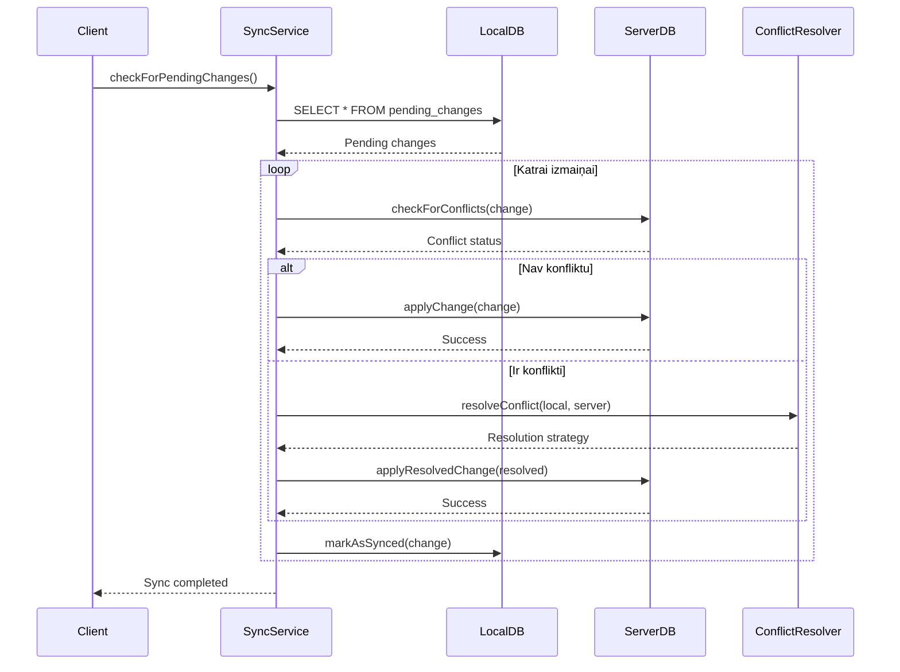
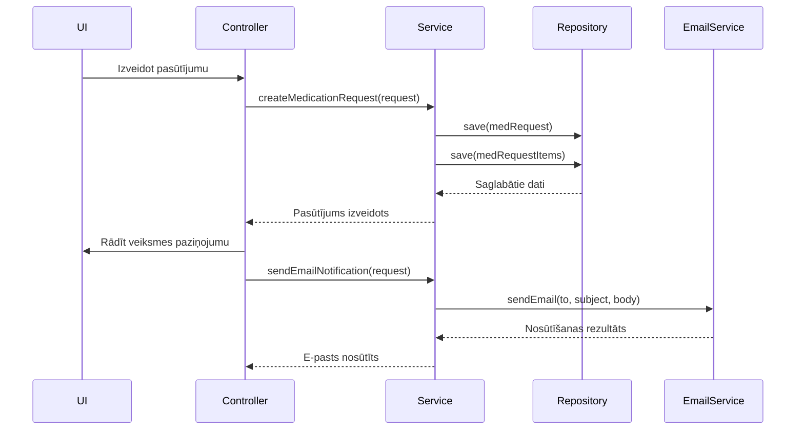
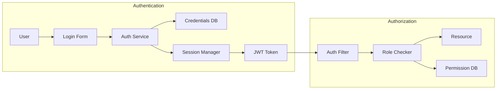

# Klientu Reģistrs - Sistēmas Arhitektūra

**Versija:** 2.1.0  
**Statuss:** PRODUKCIJAS GATAVS  
**Izstrādātājs:** Dāvis Strazds  

---

## SATURA RĀDĪTĀJS

1. [ARHITEKTŪRAS PĀRSKATS](#1-arhitektūras-pārskats)
2. [DAUDZSLŅŅU MODEĻIS](#2-daudzslāņu-modelis)
3. [KOMPONENTU ARHITEKTŪRA](#3-komponentu-arhitektūra)
4. [DATU PLŪSMAS](#4-datu-plūsmas)
5. [TEHNOLOĢISKĀ STĒKA](#5-tehnoloģiskā-stēka)
6. [IZVĒRŠANAS UN MĒROGOŠANA](#6-izvēršana-un-mērogošana)
7. [DROŠĪBAS ARHITEKTŪRA](#7-drošības-arhitektūra)
8. [VEIKTSPĒJAS OPTIMIZĀCIJA](#8-veiktspējas-optimizācija)
9. [PAPLAŠINĀMAS STRATĒGIJA](#9-paplašināmas-stratēģija)

---

## 1. ARHITEKTŪRAS PĀRSKATS

### 1.1. Arhitektūras principi

Sistēma "Klientu Reģistrs" ir veidota pēc **daudzslāņu arhitektūras** principiem, nodrošinot skaidru atbildību sadalījumu un vieglu uzturēšanu.

**Galvenie principi:**
- **Modularitāte:** Katra funkcija ir atsevišķs modulis
- **Atkarību injekcija:** Servisi tiek injektēti, nevis izveidoti
- **Single Responsibility:** Katra klase atbild par vienu uzdevumu
- **Open/Closed:** Sistēma ir atvērta paplašināšanai, bet slēgta modifikācijai
- **Interface Segregation:** Mazas, specifiskas interfeisi
- **Dependency Inversion:** Atkarības no abstrakcijām, nevis konkrētām implementācijām

### 1.2. Arhitektūras diagramma



### 1.3. Galvenie komponentu bloki

```
┌─────────────────────────────────────────────────────────────┐
│                    PREZENTĀCIJAS SLĀNIS                   │
├─────────────────────────────────────────────────────────────┤
│ ┌─────────────┐ ┌─────────────┐ ┌─────────────────────┐ │
│ │ JavaFX FXML │ │   CSS       │ │    UI Controllers   │ │
│ │ (Views)     │ │ (Styles)    │ │ (User Interactions) │ │
│ └─────────────┘ └─────────────┘ └─────────────────────┘ │
└─────────────────────────────────────────────────────────────┘
┌─────────────────────────────────────────────────────────────┐
│                   KONTROLIERU SLĀNIS                     │
├─────────────────────────────────────────────────────────────┤
│ ┌─────────────┐ ┌─────────────┐ ┌─────────────────────┐ │
│ │ Validation  │ │ Event       │ │   Form Actions      │ │
│ │ Service     │ │ Handlers    │ │   Navigation        │ │
│ └─────────────┘ └─────────────┘ └─────────────────────┘ │
└─────────────────────────────────────────────────────────────┘
┌─────────────────────────────────────────────────────────────┐
│                     SERVISU SLĀNIS                        │
├─────────────────────────────────────────────────────────────┤
│ ┌─────────────┐ ┌─────────────┐ ┌─────────────────────┐ │
│ │ Business    │ │ Transaction │ │   Security          │ │
│ │ Logic       │ │ Management  │ │   Services          │ │
│ └─────────────┘ └─────────────┘ └─────────────────────┘ │
└─────────────────────────────────────────────────────────────┘
┌─────────────────────────────────────────────────────────────┐
│                 DATU PIEKĻUVES SLĀNIS                     │
├─────────────────────────────────────────────────────────────┤
│ ┌─────────────┐ ┌─────────────┐ ┌─────────────────────┐ │
│ │ Repository  │ │ Connection  │ │   Sync/Buffer       │ │
│ │ Pattern     │ │   Pool      │ │   Services          │ │
│ └─────────────┘ └─────────────┘ └─────────────────────┘ │
└─────────────────────────────────────────────────────────────┘
┌─────────────────────────────────────────────────────────────┐
│                     DATU SLĀNIS                            │
├─────────────────────────────────────────────────────────────┤
│ ┌─────────────┐ ┌─────────────┐ ┌─────────────────────┐ │
│ │   MySQL     │ │   H2/SQLite │ │   File System      │ │
│ │ (Server)    │ │ (Local)     │ │ (Configs/Logs)    │ │
│ └─────────────┘ └─────────────┘ └─────────────────────┘ │
└─────────────────────────────────────────────────────────────┘
```

---

## 2. DAUDZSLŅŅU MODELIS

### 2.1. Prezentācijas slānis (Presentation Layer)

**Atbildības:**
- Lietotāja saskarne (UI)
- Notikumu apstrāde
- Ievades validācija
- Navigācija

**Galvenās komponentes:**
- **JavaFX FXML:** UI definīcija
- **CSS stili:** Vizuālais dizains
- **Controller klases:** Loģika starp UI un servisiem

### 2.2. Kontrolieru slānis (Controller Layer)

**Atbildības:**
- Lietotāja ievades apstrāde
- Biznesa loģikas izsaukšana
- Datu transformācija
- Kļūdu apstrāde

**Galvenās komponentes:**
- **ValidationService:** Datu validācija
- **Event Handlers:** Notikumu apstrāde
- **Form Actions:** Formu darbības

### 2.3. Servisu slānis (Service Layer)

**Atbildības:**
- Biznesa loģika
- Transakciju pārvaldība
- Drošības pakalpojumi
- Datu transformācija

**Galvenās komponentes:**
- **Business Logic:** Pamata biznesa noteikumi
- **Transaction Management:** Transakciju kontrole
- **Security Services:** Autentifikācija, autorizācija

### 2.4. Datu piekļuves slānis (Data Access Layer)

**Atbildības:**
- Datu persistencija
- Datubāzes savienojumi
- Datu sinhronizācija
- Kešatmiņa

**Galvenās komponentes:**
- **Repository Pattern:** Datu piekļuves abstrakcija
- **Connection Pool:** Savienojumu pārvaldība
- **Sync Services:** Datu sinhronizācija

### 2.5. Datu slānis (Data Layer)

**Atbildības:**
- Datu glabātuve
- Failu sistēma
- Konfigurācijas faili
- Žurnālfaili

**Galvenās komponentes:**
- **MySQL Server:** Centralizētā datubāze
- **H2/SQLite:** Lokālā datubāze
- **File System:** Failu glabātuve

---

## 3. KOMPONENTU ARHITEKTŪRA

### 3.1. Pakotņu struktūra

```
lv.socialcare/
├── Main.java                     # Galvenā aplikācijas klase
├── Launcher.java                 # Startēšanas wrappers
├── AppDataService.java          # Centrālais servisu fasāde
├── SharedDataService.java       # Globālais datu kešatmiņa
├── SessionManager.java          # Sesiju pārvaldība
├── ConfigurationService.java    # Konfigurācijas pārvaldība
├── admin/                       # Administratora funkcijas
│   ├── AdminToolsController.java
│   ├── UserManagementController.java
│   └── TemplateManagementController.java
├── client/                      # Klientu pārvaldība
│   ├── HubController.java       # Galvenais panelis
│   ├── ClientListViewController.java
│   └── ClientRegisterController.java
├── clientcard/                  # Klienta kartes funkcionalitāte
│   ├── ClientCardController.java
│   ├── karte/KarteController.java
│   ├── protokols/ProtokolsController.java
│   ├── aprupesplans/AprupesPlansController.java
│   └── rehabilitacijasplans/RehabilitacijasPlansController.java
├── database/                    # Datu bāzes slānis
│   ├── DatabaseConnectionManager.java
│   ├── SchemaManager.java
│   └── repositories/
│       ├── KlientsRepository.java
│       ├── PlanRepository.java
│       └── [citi repozitoriji]
├── view/                        # Vispārējie UI komponenti
│   ├── ViewManager.java
│   ├── UIUtils.java
│   ├── ValidationService.java
│   └── [citi UI helperi]
├── statistics/                  # Statistikas moduļi
├── nodarbibas/                  # Nodarbību pārvaldība
├── medikamenti/                 # Medikamentu pārvaldība
├── slimnica/                    # Slimnīcas veidlapas
├── sync/                        # Datu sinhronizācija
├── license/                     # Licencēšana un drošība
└── appservices/                 # Infrastruktūras servisi
```

### 3.2. Galvenās komponentes

#### 3.2.1. Main.java (Application Entry Point)

```java
public class Main extends Application {
    private AppDataService appDataService;
    private ViewManager viewManager;
    private LicenseManager licenseManager;
    
    @Override
    public void start(Stage primaryStage) {
        // Inicializācija
        initializeServices();
        
        // Licences pārbaude
        if (!runInitialSetup(primaryStage)) {
            return;
        }
        
        // Datubāzes savienojums
        if (!establishDatabaseConnection()) {
            return;
        }
        
        // Galvenās saskarnes palaišana
        launchMainUI();
    }
}
```

#### 3.2.2. AppDataService.java (Service Facade)

```java
public class AppDataService {
    private final Map<Class<?>, Object> services = new ConcurrentHashMap<>();
    
    public <T> T getService(Class<T> serviceClass) {
        return serviceClass.cast(services.computeIfAbsent(serviceClass, 
            clazz -> createService(clazz)));
    }
    
    private <T> T createService(Class<T> serviceClass) {
        // Dinamiska servisu izveide ar atkarību injekciju
        if (serviceClass == KlientsRepository.class) {
            return serviceClass.cast(new KlientsRepository(getConnectionManager()));
        }
        // ... citi servisi
        throw new IllegalArgumentException("Unknown service: " + serviceClass);
    }
}
```

#### 3.2.3. ViewManager.java (UI Facade)

```java
public class ViewManager {
    private final Map<String, FXMLLoader> loaders = new HashMap<>();
    private final Stage primaryStage;
    
    public <T> T openView(String fxmlPath, String title) {
        try {
            FXMLLoader loader = new FXMLLoader(getClass().getResource(fxmlPath));
            Parent root = loader.load();
            
            Stage stage = new Stage();
            stage.setTitle(title);
            stage.setScene(new Scene(root));
            stage.initModality(Modality.APPLICATION_MODAL);
            stage.show();
            
            return loader.getController();
        } catch (IOException e) {
            throw new RuntimeException("Failed to load view: " + fxmlPath, e);
        }
    }
}
```

### 3.3. Repository Pattern Implementācija

#### 3.3.1. Bāzes repozitorijs

```java
public abstract class BaseRepository<T> {
    protected final DatabaseConnectionManager connectionManager;
    
    protected BaseRepository(DatabaseConnectionManager connectionManager) {
        this.connectionManager = connectionManager;
    }
    
    protected Connection getConnection() throws SQLException {
        return connectionManager.getConnection();
    }
    
    public abstract T save(T entity) throws SQLException;
    public abstract Optional<T> findById(Integer id) throws SQLException;
    public abstract List<T> findAll() throws SQLException;
    public abstract void delete(Integer id) throws SQLException;
}
```

#### 3.3.2. Konkrēts repozitorijs

```java
public class KlientsRepository extends BaseRepository<Klients> {
    
    public KlientsRepository(DatabaseConnectionManager connectionManager) {
        super(connectionManager);
    }
    
    @Override
    public Klients save(Klients klients) throws SQLException {
        String sql = "INSERT INTO klienti (personas_kods, vards, uzvards, ...) " +
                    "VALUES (?, ?, ?, ...)";
        
        try (Connection conn = getConnection();
             PreparedStatement stmt = conn.prepareStatement(sql, Statement.RETURN_GENERATED_KEYS)) {
            
            stmt.setString(1, klients.getPersonasKods());
            stmt.setString(2, klients.getVards());
            stmt.setString(3, klients.getUzvards());
            // ... citi lauki
            
            int affectedRows = stmt.executeUpdate();
            if (affectedRows == 0) {
                throw new SQLException("Creating client failed, no rows affected.");
            }
            
            try (ResultSet generatedKeys = stmt.getGeneratedKeys()) {
                if (generatedKeys.next()) {
                    klients.setId(generatedKeys.getInt(1));
                }
            }
        }
        
        return klients;
    }
    
    @Override
    public Optional<Klients> findById(Integer id) throws SQLException {
        String sql = "SELECT * FROM klienti WHERE id = ?";
        
        try (Connection conn = getConnection();
             PreparedStatement stmt = conn.prepareStatement(sql)) {
            
            stmt.setInt(1, id);
            
            try (ResultSet rs = stmt.executeQuery()) {
                if (rs.next()) {
                    return mapResultSetToKlients(rs);
                }
            }
        }
        
        return Optional.empty();
    }
    
    private Klients mapResultSetToKlients(ResultSet rs) throws SQLException {
        Klients klients = new Klients();
        klients.setId(rs.getInt("id"));
        klients.setPersonasKods(rs.getString("personas_kods"));
        klients.setVards(rs.getString("vards"));
        klients.setUzvards(rs.getString("uzvards"));
        // ... citi lauki
        return klients;
    }
}
```

---

## 4. DATU PLŪSMAS

### 4.1. Klienta datu saglabāšanas plūsma



### 4.2. Datu sinhronizācijas plūsma



### 4.3. Medikamentu pasūtījuma plūsma



---

## 5. TEHNOLOĢISKĀ STĒKA

### 5.1. Java platforma

**Java 21 LTS (Long Term Support):**
- Modernās valodas iespējas (Records, Pattern Matching)
- Uzlabota veiktspēja
- Ilgtermiņa atbalsts
- Modulārā arhitektūra

**Galvenās bibliotēkas:**
- **JavaFX 21:** GUI ietvars
- **HikariCP:** Savienojumu pūls
- **Apache POI:** Excel apstrāde
- **Gson:** JSON serializācija
- **SLF4J + Logback:** Žurnālieraksti

### 5.2. Datubāzes tehnoloģijas

**MySQL 8.0+ (Centralizētā datubāze):**
- ACID atbilstība
- Transakciju atbalsts
- Indeksi un optimizācija
- Replicācijas iespējas

**H2 Database (Lokālā datubāze):**
- Iegultā režīmā
- SQL atbilstība
- Ātra darbība
- Mazs resursu patēriņš

### 5.3. Build un deployment rīki

**Apache Maven:**
- Atkarību pārvaldība
- Build lifecycle
- Plugin ekosistēma
- Repozitoriju atbalsts

**Deployment opcijas:**
- Standalone JAR
- Windows installer
- Portable versija
- Docker containers (nākotnē)

---

## 6. IZVĒRŠANAS UN MĒROGOŠANA

### 6.1. Horizontālā mērogošana

**Datu bāzes līmeņa mērogošana:**
```
┌─────────────────────────────────────────────────────┐
│                   LOAD BALANCER                      │
├─────────────────────────────────────────────────────┤
│ ┌─────────────┐ ┌─────────────┐ ┌─────────────┐ │
│ │   App 1     │ │   App 2     │ │   App 3     │ │
│ │ Instance     │ │ Instance     │ │ Instance     │ │
│ └─────────────┘ └─────────────┘ └─────────────┘ │
└─────────────────────────────────────────────────────┘
┌─────────────────────────────────────────────────────┐
│                MySQL MASTER/SLAVE                   │
│ ┌─────────────┐ ┌─────────────┐ ┌─────────────┐ │
│ │   Master     │ │   Slave 1    │ │   Slave 2    │ │
│ │ (Writes)    │ │ (Reads)      │ │ (Reads)      │ │
│ └─────────────┘ └─────────────┘ └─────────────┘ │
└─────────────────────────────────────────────────────┘
```

### 6.2. Vertikālā mērogošana

**Datu bāzes sadalīšana:**
```
┌─────────────────────────────────────────────────────┐
│                APPLICATION LAYER                   │
├─────────────────────────────────────────────────────┤
│ ┌─────────────┐ ┌─────────────┐ ┌─────────────┐ │
│ │   Client     │ │   Medical    │ │   Admin      │ │
│ │   Service   │ │   Service   │ │   Service    │ │
│ └─────────────┘ └─────────────┘ └─────────────┘ │
└─────────────────────────────────────────────────────┘
┌─────────────────────────────────────────────────────┐
│                DATABASE LAYER                        │
├─────────────────────────────────────────────────────┤
│ ┌─────────────┐ ┌─────────────┐ ┌─────────────┐ │
│ │   Client     │ │   Medical    │ │   System     │ │
│ │   Database   │ │   Database   │ │   Database   │ │
│ └─────────────┘ └─────────────┘ └─────────────┘ │
└─────────────────────────────────────────────────────┘
```

### 6.3. Kešatmiņas stratēģija

**Daudzlīmeņu kešatmiņa:**
```
┌─────────────────────────────────────────────────────┐
│                    CACHE LAYER                      │
├─────────────────────────────────────────────────────┤
│ ┌─────────────┐ ┌─────────────┐ ┌─────────────┐ │
│ │   L1 Cache   │ │   L2 Cache   │ │   L3 Cache   │ │
│ │ (Memory)    │ │ (Redis)      │ │ (Database)   │ │
│ │             │ │              │ │              │ │
│ │ • Sessions  │ │ • Lookups   │ │ • Queries    │ │
│ │ • Temp data │ │ • Results    │ │ • Reports    │ │
│ └─────────────┘ └─────────────┘ └─────────────┘ │
└─────────────────────────────────────────────────────┘
```

---

## 7. DROŠĪBAS ARHITEKTŪRA

### 7.1. Drošības slāņi

```
┌─────────────────────────────────────────────────────┐
│                SECURITY LAYERS                      │
├─────────────────────────────────────────────────────┤
│ ┌─────────────┐ ┌─────────────┐ ┌─────────────┐ │
│ │   Network    │ │   Application│ │   Data       │ │
│ │   Security   │ │   Security   │ │   Security   │ │
│ └─────────────┘ └─────────────┘ └─────────────┘ │
└─────────────────────────────────────────────────────┘
```

### 7.2. Autentifikācijas un autorizācijas arhitektūra



### 7.3. Datu šifrēšanas arhitektūra

```
┌─────────────────────────────────────────────────────┐
│                ENCRYPTION ARCHITECTURE            │
├─────────────────────────────────────────────────────┤
│ ┌─────────────┐ ┌─────────────┐ ┌─────────────┐ │
│ │   Data at    │ │   Data in    │ │   Key        │ │
│ │   Rest       │ │   Transit     │ │   Management  │ │
│ │   (AES-256)  │ │   (TLS 1.3)  │ │   (HSM)      │ │
│ └─────────────┘ └─────────────┘ └─────────────┘ │
└─────────────────────────────────────────────────────┘
```

---

## 8. VEIKTSPĒJAS OPTIMIZĀCIJA

### 8.1. Datubāzes optimizācija

**Indeksu stratēģija:**
```sql
-- Klientu meklēšanas optimizācija
CREATE INDEX idx_klienti_search ON klienti(vards, uzvards, personas_kods);
CREATE INDEX idx_klienti_status ON klienti(statuss, iestāšanas_datums);

-- Plānu optimizācija
CREATE INDEX idx_plāni_klients_veids ON plāni(klienta_id, plana_veids, statuss);
CREATE INDEX idx_plāni_datumi ON plāni(sākuma_datums, beigu_datums);

-- Nodarbību optimizācija
CREATE INDEX idx_nodarbibas_datums ON nodarbibas(datums, klienta_id);
CREATE INDEX idx_nodarbibas_aktivitate ON nodarbibas(aktivitates_id);
```

**Query optimizācija:**
```java
public class OptimizedQueries {
    // Izmantojot prepared statements
    private static final String SEARCH_CLIENTS_SQL = 
        "SELECT * FROM klienti WHERE " +
        "(vards LIKE ? OR uzvards LIKE ? OR personas_kods = ?) " +
        "AND statuss = ? " +
        "ORDER BY uzvards, vards " +
        "LIMIT ? OFFSET ?";
    
    // Batch operācijas
    public void batchInsertClients(List<Klients> clients) {
        try (Connection conn = getConnection();
             PreparedStatement stmt = conn.prepareStatement(INSERT_SQL)) {
            
            for (Klients client : clients) {
                stmt.setString(1, client.getPersonasKods());
                stmt.setString(2, client.getVards());
                stmt.setString(3, client.getUzvards());
                stmt.addBatch();
            }
            
            stmt.executeBatch();
        }
    }
}
```

### 8.2. Atmiņas pārvaldība

**Java VM optimizācija:**
```bash
# JVM parametri augstai veiktspējai
-Xms512m -Xmx2048m
-XX:+UseG1GC
-XX:MaxGCPauseMillis=200
-XX:+UseStringDeduplication
-Dfile.encoding=UTF-8
-Duser.timezone=Europe/Riga
```

**Connection pool konfigurācija:**
```java
public class OptimizedConnectionPool {
    private HikariConfig createConfig() {
        HikariConfig config = new HikariConfig();
        config.setMaximumPoolSize(20);
        config.setMinimumIdle(5);
        config.setConnectionTimeout(30000);
        config.setIdleTimeout(600000);
        config.setMaxLifetime(1800000);
        
        // Performance optimizācija
        config.addDataSourceProperty("cachePrepStmts", "true");
        config.addDataSourceProperty("prepStmtCacheSize", "250");
        config.addDataSourceProperty("prepStmtCacheSqlLimit", "2048");
        config.addDataSourceProperty("useServerPrepStmts", "true");
        
        return config;
    }
}
```

### 8.3. Asinhronā apstrāde

**JavaFX Task implementācija:**
```java
public class AsyncTaskManager {
    public static <T> void runAsync(Callable<T> task, Consumer<T> onSuccess, 
                                   Consumer<Exception> onError) {
        Task<T> javafxTask = new Task<>() {
            @Override
            protected T call() throws Exception {
                return task.call();
            }
            
            @Override
            protected void succeeded() {
                onSuccess.accept(getValue());
            }
            
            @Override
            protected void failed() {
                onError.accept(getException());
            }
        };
        
        new Thread(javafxTask).start();
    }
}
```

---

## 9. PAPLAŠINĀMAS STRATĒGIJA

### 9.1. Plugin arhitektūra

**Plugin interfeiss:**
```java
public interface Plugin {
    String getName();
    String getVersion();
    void initialize(PluginContext context);
    void shutdown();
    List<ExtensionPoint> getExtensionPoints();
}
```

**Plugin konteksts:**
```java
public class PluginContext {
    private final ServiceRegistry serviceRegistry;
    private final EventBus eventBus;
    private final ConfigurationManager configManager;
    
    public PluginContext(ServiceRegistry serviceRegistry, 
                        EventBus eventBus, 
                        ConfigurationManager configManager) {
        this.serviceRegistry = serviceRegistry;
        this.eventBus = eventBus;
        this.configManager = configManager;
    }
    
    public <T> T getService(Class<T> serviceClass) {
        return serviceRegistry.getService(serviceClass);
    }
    
    public void publishEvent(Event event) {
        eventBus.publish(event);
    }
}
```

### 9.2. Event-driven arhitektūra

**Event sistēma:**
```java
public class EventBus {
    private final Map<Class<?>, List<Consumer<?>>> subscribers = new ConcurrentHashMap<>();
    
    @SuppressWarnings("unchecked")
    public <T> void subscribe(Class<T> eventType, Consumer<T> handler) {
        subscribers.computeIfAbsent(eventType, k -> new ArrayList<>()).add(handler);
    }
    
    @SuppressWarnings("unchecked")
    public <T> void publish(T event) {
        List<Consumer<?>> handlers = subscribers.get(event.getClass());
        if (handlers != null) {
            handlers.forEach(handler -> ((Consumer<T>) handler).accept(event));
        }
    }
}
```

### 9.3. Mikroservisu migrācija

**Nākotnes arhitektūra:**
```
┌─────────────────────────────────────────────────────┐
│                API GATEWAY                        │
├─────────────────────────────────────────────────────┤
│ ┌─────────────┐ ┌─────────────┐ ┌─────────────┐ │
│ │   Client     │ │   Medical    │ │   Admin      │ │
│ │   Service   │ │   Service   │ │   Service    │ │
│ │   (Spring)  │ │   (Spring)  │ │   (Spring)   │ │
│ └─────────────┘ └─────────────┘ └─────────────┘ │
└─────────────────────────────────────────────────────┘
┌─────────────────────────────────────────────────────┐
│                SERVICE MESH                        │
├─────────────────────────────────────────────────────┤
│ ┌─────────────┐ ┌─────────────┐ ┌─────────────┐ │
│ │   Client     │ │   Medical    │ │   Admin      │ │
│ │   Database   │ │   Database   │ │   Database   │ │
│ │   (MySQL)    │ │   (PostgreSQL)│ │   (MySQL)    │ │
│ └─────────────┘ └─────────────┘ └─────────────┘ │
└─────────────────────────────────────────────────────┘
```

### 9.4. Cloud migrācijas ceļvedis

1. **Fāze 1: Containerization**
   - Docker konteinerizācija
   - Kubernetes deployment
   - CI/CD pipeline

2. **Fāze 2: Service Decomposition**
   - Monolith → Microservices
   - API Gateway implementācija
   - Service discovery

3. **Fāze 3: Cloud Migration**
   - AWS/Azure/GCP deployment
   - Managed databases
   - Monitoring un logging

4. **Fāze 4: Optimization**
   - Auto-scaling
   - Load balancing
   - Disaster recovery

---

## PIELIKUMI

### Pielikums A: Arhitektūras lēmumu dokumenti

| Lēmums | Apraksts | Ieviešanas datums | Statuss |
|---------|----------|-------------------|---------|
| DDD-001 | Domain Driven Design ieviešana | 2024.02.01 | Plānots |
| CQRS-001 | CQRS pattern implementācija | 2024.03.01 | Plānots |
| EVENT-001 | Event-driven arhitektūra | 2024.04.01 | Plānots |
| MICRO-001 | Mikroservisu migrācija | 2024.06.01 | Plānots |

### Pielikums B: Tehniskās prasības

| Komponente | Minimālās prasības | Ieteicamās prasības |
|-----------|-------------------|-------------------|
| CPU | 2 cores | 4 cores |
| RAM | 4 GB | 8 GB |
| Disk | 50 GB SSD | 100 GB SSD |
| Network | 100 Mbps | 1 Gbps |
| Database | MySQL 8.0 | MySQL 8.0+ with replication |

### Pielikums C: Performance metriku

| Metrika | Mērīšanas vienība | Mērķis |
|---------|-------------------|---------|
| Response time | ms | < 200 |
| Throughput | requests/sec | > 100 |
| CPU utilization | % | < 70 |
| Memory usage | % | < 80 |
| Database connections | count | < 50 |

---

**Dokumenta beigas**

© 2024 Dāvis Strazds. Visas tiesības aizsargātas.

Šī arhitektūras dokumentācija ir paredzēta sistēmas izstrādātājiem un arhitektiem. Tās izplatīšana bez atļaujas ir aizliegta.

*Pēdējoreiz atjaunināts: 2024. gada 15. janvārī*
