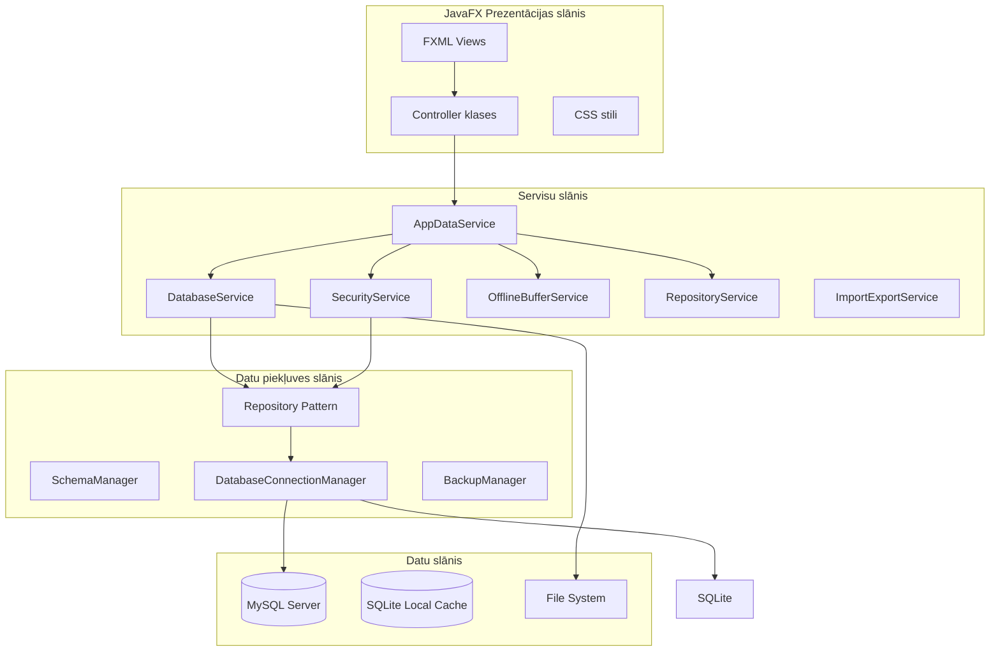
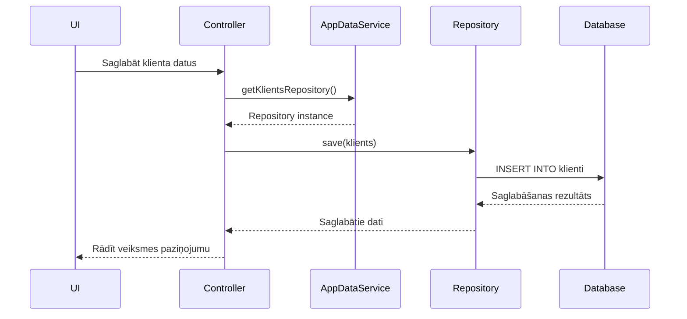
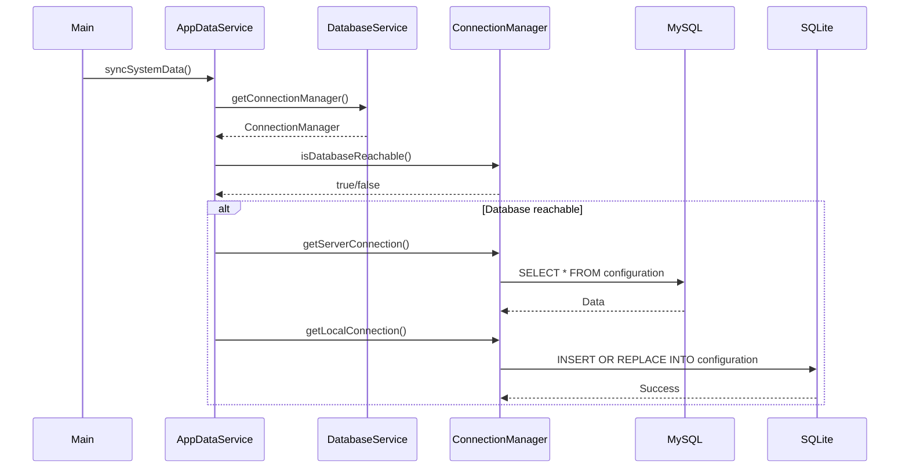

# Klientu Reģistrs - Sistēmas Arhitektūra (100% Realitāte)

**Versija:** 2.1.0  
**Statuss:** PRODUKCIJAS GATAVS  
**Izstrādātājs:** Dāvis Strazds  
**Pārbaudīts:** 2026.04.09  

---

## SATURA RĀDĪTĀJS

1. [ARHITEKTŪRAS PĀRSKATS](#1-arhitektūras-pārskats)
2. [PAKOTŅU STRUKTŪRA](#2-pakotņu-struktūra)
3. [GALVENĀS KOMPONENTES](#3-galvenās-komponentes)
4. [DATU PIEKĻUVES SLĀNIS](#4-datu-piekļuves-slānis)
5. [SERISU ARHITEKTŪRA](#5-servisu-arhitektūra)
6. [UI KONTROLIERU SLĀNIS](#6-ui-kontrolieru-slānis)
7. [DATU PLŪSMAS](#7-datu-plūsmas)
8. [TEHNOLOĢISKĀ STĒKA](#8-tehnoloģiskā-stēka)
9. [DROŠĪBAS ARHITEKTŪRA](#9-drošības-arhitektūra)

---

## 1. ARHITEKTŪRAS PĀRSKATS

Šī sistēma izmanto **MVC (Model-View-Controller)** arhitektūras principu un modernu **Offline-First** pieeju, lai nodrošinātu darba nepārtrauktību.

### 1.1. Galvenās arhitektūras komponentes
- **Datu loģika**: Nodalīta caur modeļiem (Klients, ClientCardInfo).
- **Vizuālais attēlojums**: Definēts .fxml failos.
- **Vadība**: Specializēti kontrolieri (HubController, ClientCardController).

### 1.1. Arhitektūras diagramma (faktiskā)



### 1.2. Faktiskās slāņu atbildības

**Prezentācijas slānis:**
- JavaFX FXML faili definē UI
- Controller klases apstrādā notikumus
- CSS stili nodrošina vizuālo izskatu

**Servisu slānis:**
- `AppDataService` - centrālais servisu fasāde
- `DatabaseService` - datubāzes pārvaldība
- `SecurityService` - drošības un autentifikācija
- `RepositoryService` - repozitoriju pārvaldība
- `ImportExportService` - datu imports/eksports

**Datu piekļuves slānis:**
- Repository Pattern implementācija
- `DatabaseConnectionManager` - savienojumu pārvaldība
- `SchemaManager` - datubāzes shēmas un migrāciju pārvaldība (nodrošina MySQL/SQLite dialektu saderību)
- `BackupManager` - rezerves kopiju pārvaldība

---

## 2. PAKOTŅU STRUKTŪRA

### 2.1. Faktiskā pakotņu struktūra

```
lv.socialcare/
├── Main.java                     # Galvenā aplikācijas klase
├── AppDataService.java          # Centrālais servisu fasāde
├── ConfigurationService.java    # Konfigurācijas pārvaldība
├── SessionManager.java          # Sesiju pārvaldība
├── SharedDataService.java       # Globālais datu kešatmiņa
├── MySQLConfig.java             # MySQL konfigurācija
├── ExcelManager.java             # Excel apstrāde
├── CryptoUtils.java              # Šifrēšanas rīki
├── DataImportService.java        # Datu imports
├── LoggingService.java          # Žurnālieraksti
├── MappingManager.java           # Veidņu kartēšana
├── TemplateManager.java          # Veidņu pārvaldība
├── admin/                        # Administratora funkcijas
│   ├── AdminService.java
│   ├── AdminToolsController.java
│   ├── UserManagementController.java
│   ├── DeletedClientsController.java
│   ├── PurgeConfirmationController.java
│   ├── TemplateManagementController.java
│   ├── TemplateMappingController.java
│   └── assessment/
│       ├── AssessmentEditorController.java
│       └── CriterionDialogController.java
├── client/                      # Klientu pārvaldība
│   ├── HubController.java
│   ├── ClientListViewController.java
│   └── ClientRegisterController.java
├── clientcard/                  # Klienta kartes funkcionalitāte
│   ├── KarteController.java
│   ├── karte/KarteController.java
│   ├── protokols/ProtokolsController.java
│   ├── aprupesplans/AprupesPlansController.java
│   ├── rehabilitacijasplans/RehabilitacijasPlansController.java
│   ├── sarunasapraksts/SarunasAprakstsController.java
│   ├── novertesanakarte/NovertesanaKarteController.java
│   ├── citainformacija/CitaInformacijaController.java
│   ├── invenmantuakts/MantuAktsController.java
│   └── invennaudasakts/NaudasAktsController.java
├── database/                    # Datu bāzes slānis
│   ├── DatabaseConnectionManager.java
│   ├── SchemaManager.java
│   ├── BackupManager.java
│   └── repositories/
│       ├── KlientsRepository.java
│       ├── ActivityRepository.java
│       ├── PlanRepository.java
│       ├── HealthCardRepository.java
│       ├── FamilyMemberRepository.java
│       ├── ClientCardInfoRepository.java
│       ├── UserCredentialsRepository.java
│       ├── UserSessionRepository.java
│       ├── AuditLogRepository.java
│       ├── NotificationRepository.java
│       ├── ConfigRepository.java
│       ├── ListRepository.java
│       ├── NodarbibaRepository.java
│       ├── MedRequestRepository.java
│       ├── MantuAktsRepository.java
│       ├── NaudasAktsRepository.java
│       ├── ClientDocumentRepository.java
│       ├── NovertesanaRepository.java
│       ├── ProtokolsRepository.java
│       └── SarunasAprakstsRepository.java
├── view/                        # Vispārējie UI komponenti
│   ├── ViewManager.java
│   ├── UIUtils.java
│   ├── ValidationService.java
│   └── LoginController.java
├── statistics/                  # Statistikas moduļi
├── nodarbibas/                  # Nodarbību pārvaldība
│   ├── MainController.java
│   ├── ManageActivitiesController.java
│   └── ActivityAnalysisDashboardController.java
├── medikamenti/                 # Medikamentu pārvaldība
│   ├── MedRequestCenterController.java
│   └── MedRequestController.java
├── slimnica/                    # Slimnīcas veidlapas
│   └── HospitalFormController.java
├── health/                      # Veselības kartes
│   └── HealthFormController.java
├── sync/                        # Datu sinhronizācija
├── license/                     # Licencēšana un drošība
│   ├── LicenseManager.java
│   └── LocalSecurityManager.java
├── users/                       # Lietotāju pārvaldība
│   ├── Role.java
│   └── User.java
├── appservices/                 # Infrastruktūras servisi
│   ├── DatabaseService.java
│   ├── SecurityService.java
│   ├── RepositoryService.java
│   ├── ImportExportService.java
│   └── NetworkDiscoveryService.java
└── core/
    ├── ServiceRegistry.java
    └── [citi core komponenti]
```

---

## 3. GALVENĀS KOMPONENTES

### 3.1. Main.java (faktiskā implementācija)

**Galvenās atbildības:**
- JavaFX aplikācijas startēšana
- Servisu inicializācija
- Licences pārbaude
- Datubāzes savienojuma izveide
- UI palaišana

**Faktiskās metodes:**
```java
public class Main extends Application {
    private AppDataService appDataService;
    private ViewManager viewManager;
    private LicenseManager licenseManager;
    private MySQLConfig mySQLConfig;
    private ExcelManager excelManager;
    
    @Override
    public void start(Stage primaryStage) {
        // Inicializācija
        initializeServices();
        
        // Licences pārbaude
        if (!runInitialSetup(primaryStage)) {
            return;
        }
        
        // Datubāzes savienojums
        if (!establishDatabaseConnection()) {
            return;
        }
        
        // Galvenās saskarnes palaišana
        launchMainUI();
    }
}
```

### 3.2. AppDataService.java (faktiskā implementācija)

**Galvenās atbildības:**
- Centrālais servisu fasāde
- Repozitoriju piekļuve
- Datu sinhronizācija
- Dienas uzdevumu plānošana

**Faktiskie servisi:**
```java
public class AppDataService {
    // Jaunie servisi
    private final DatabaseService databaseService;
    private final SecurityService securityService;
    private final RepositoryService repositoryService;
    private ImportExportService importExportService;
    
    // Repozitoriju piekļuve
    public KlientsRepository getKlientsRepository()
    public ActivityRepository getActivityRepository()
    public PlanRepository getPlanRepository()
    public HealthCardRepository getHealthCardRepository()
    // ... citi repozitoriji
}
```

### 3.3. DatabaseConnectionManager.java (faktiskā implementācija)

**Galvenās atbildības:**
- MySQL un SQLite savienojumi
- Savienojumu pūla pārvaldība
- Datubāzes tipu noteikšana
- Failošu pārslēgšana

**Faktiskās metodes:**
```java
public class DatabaseConnectionManager {
    public Connection connect() throws SQLException
    public Connection getServerConnection() throws SQLException
    public Connection getLocalConnection() throws SQLException
    public boolean isDatabaseReachable()
    public void forceResetDataSource()
}
```

---

## 4. DATU PIEKĻUVES SLĀNIS

### 4.1. Repository Pattern (faktiskā implementācija)

**Bāzes repozitorijs:**
```java
public abstract class BaseRepository<T> {
    protected final DatabaseConnectionManager connectionManager;
    
    protected Connection getConnection() throws SQLException {
        return connectionManager.getConnection();
    }
    
    public abstract T save(T entity) throws SQLException;
    public abstract Optional<T> findById(Integer id) throws SQLException;
    public abstract List<T> findAll() throws SQLException;
    public abstract void delete(Integer id) throws SQLException;
}
```

**Konkrēts repozitorijs (KlientsRepository.java):**
```java
public class KlientsRepository extends BaseRepository<Klients> {
    public KlientsRepository(DatabaseConnectionManager connectionManager) {
        super(connectionManager);
    }
    
    @Override
    public Klients save(Klients klients) throws SQLException {
        String sql = "INSERT INTO klienti (personas_kods, vards, uzvards, ...) " +
                    "VALUES (?, ?, ?, ...)";
        // Implementācija...
    }
    
    @Override
    public Optional<Klients> findById(Integer id) throws SQLException {
        String sql = "SELECT * FROM klienti WHERE id = ?";
        // Implementācija...
    }
}
```

### 4.2. Faktiskie repozitoriji

**Klientu dati:**
- `KlientsRepository` - klientu pamatdati
- `ClientCardInfoRepository` - klienta kartes papildus info
- `FamilyMemberRepository` - ģimenes locekļi

**Medicīniskie dati:**
- `HealthCardRepository` - veselības kartes
- `MedRequestRepository` - medikamentu pieprasījumi

**Sociālie dati:**
- `PlanRepository` - aprūpes un rehabilitācijas plāni
- `ActivityRepository` - nodarbības
- `NodarbibaRepository` - nodarbību veidi
- `ProtokolsRepository` - protokoli
- `SarunasAprakstsRepository` - sarunu apraksti
- `NovertesanaRepository` - novērtēšanas kartes

**Sistēmas dati:**
- `UserCredentialsRepository` - lietotāju konti
- `UserSessionRepository` - sesijas
- `AuditLogRepository` - darbību žurnāls
- `NotificationRepository` - paziņojumi
- `ConfigRepository` - konfigurācija

---

## 5. SERISU ARHITEKTŪRA

### 5.1. DatabaseService (faktiskā implementācija)

**Galvenās atbildības:**
- Datubāzes inicializācija
- Konfigurācijas pārvaldība
- Shēmas pārvaldība
- Rezerves kopiju pārvaldība

**Faktiskās metodes:**
```java
public class DatabaseService {
    private final ConfigurationService configService;
    private final DatabaseConnectionManager connectionManager;
    private final SchemaManager schemaManager;
    private final BackupManager backupManager;
    private final ConfigRepository configRepository;
    
    public void initializeDatabase()
    public ConfigurationService getConfigurationService()
    public DatabaseConnectionManager getConnectionManager()
    public SchemaManager getSchemaManager()
    public BackupManager getBackupManager()
}
```

### 5.2. SecurityService (faktiskā implementācija)

**Galvenās atbildības:**
- Lietotāju autentifikācija
- Autorizācija
- Sesiju pārvaldība
- Audita žurnāls

**Faktiskās metodes:**
```java
public class SecurityService {
    private final UserCredentialsRepository userCredentialsRepository;
    private final UserSessionRepository userSessionRepository;
    private final AuditLogRepository auditLogRepository;
    
    public UserCredentialsRepository getUserCredentialsRepository()
    public UserSessionRepository getUserSessionRepository()
    public AuditLogRepository getAuditLogRepository()
}
```

### 5.3. RepositoryService (faktiskā implementācija)

**Galvenās atbildības:**
- Visu repozitoriju pārvaldība
- Centralizēta piekļuve
- Atkarību injekcija

**Faktiskās metodes:**
```java
public class RepositoryService {
    private final KlientsRepository klientsRepository;
    private final ActivityRepository activityRepository;
    private final PlanRepository planRepository;
    // ... citi repozitoriji
    
    public KlientsRepository getKlientsRepository()
    public ActivityRepository getActivityRepository()
    public PlanRepository getPlanRepository()
    // ... citi getteri
}
```

---

## 6. UI KONTROLIERU SLĀNIS

### 6.1. Faktiskie kontrolieri

**Administratora kontrolieri:**
- `AdminToolsController` - galvenais admin panelis
- `UserManagementController` - lietotāju pārvaldība
- `DeletedClientsController` - dzēsto klientu atjaunošana
- `PurgeConfirmationController` - datu dzēšanas apstiprināšana
- `TemplateManagementController` - Excel veidņu pārvaldība
- `TemplateMappingController` - veidņu kartēšana
- `AssessmentEditorController` - novērtēšanas kritēriju redaktors
- `CriterionDialogController` - kritērija dialogs

**Klientu kontrolieri:**
- `HubController` - galvenais panelis
- `ClientListViewController` - klientu saraksts
- `ClientRegisterController` - klientu reģistrs

**Klienta kartes kontrolieri:**
- `KarteController` - klienta karte
- `ProtokolsController` - protokoli
- `AprupesPlansController` - aprūpes plāni
- `RehabilitacijasPlansController` - rehabilitācijas plāni
- `SarunasAprakstsController` - sarunu apraksti
- `NovertesanaKarteController` - novērtēšanas karte
- `CitaInformacijaController` - papildus informācija
- `MantuAktsController` - mantu akts
- `NaudasAktsController` - naudas akts

**Nodarbību kontrolieri:**
- `MainController` - nodarbību reģistrēšana
- `ManageActivitiesController` - aktivitāšu pārvaldība
- `ActivityAnalysisDashboardController` - aktivitāšu analīze

**Medicīniskie kontrolieri:**
- `MedRequestCenterController` - medikamentu pieprasījumu centrs
- `HospitalFormController` - slimnīcas veidlapa
- `HealthFormController` - veselības karte

---

## 7. DATU PLŪSMAS

### 7.1. Klienta datu saglabāšanas plūsma (faktiskā)



### 7.2. Datu sinhronizācijas plūsma (faktiskā)



---

## 8. TEHNOLOĢISKĀ STĒKA

### 8.1. Java platforma (faktiskā)

**Java 21 LTS:**
- JavaFX 21 - GUI ietvars
- SLF4J + Logback - žurnālieraksti
- HikariCP - savienojumu pūls
- Apache POI - Excel apstrāde
- Gson - JSON serializācija

### 8.2. Datubāzes tehnoloģijas (faktiskās)

**MySQL 8.0+:**
- Centrālā datubāze
- ACID atbilstība
- Transakciju atbalsts

**SQLite:**
- Lokālā datubāze
- Bezsaistes režīms
- Ātra darbība

### 8.3. Build rīki (faktiski)

**Apache Maven:**
- Atkarību pārvaldība
- JavaFX Maven plugin
- Maven Compiler Plugin

---

## 9. DROŠĪBAS ARHITEKTŪRA

### 9.1. Autentifikācija (faktiskā)

**SessionManager.java:**
```java
public class SessionManager {
    private final ConfigurationService configService;
    private final UserSessionRepository userSessionRepository;
    
    public Integer validateSession()
    public void createSession(User user)
    public void restoreSession(User user)
    public void invalidateSession()
}
```

### 9.2. Šifrēšana (faktiskā)

**CryptoUtils.java:**
```java
public class CryptoUtils {
    private static SecretKey applicationSecretKey;
    
    public static void init(SecretKey key)
    public static String encrypt(String data)
    public static String decrypt(String encryptedData)
}
```

### 9.3. Audita žurnāls (faktiskā)

**AuditLogRepository.java:**
```java
public class AuditLogRepository {
    public void log(String username, String action, String targetEntity, String targetId)
    public List<AuditLogEntry> getRecentEntries(int limit)
    public int cleanSmartAuditLog(int daysToKeep)
}
```

---

## KONTROLERU UN DATU AVOTU SARAKSTS

### Galvenie kontrolieri:
- **`Main`** - galvenā aplikācijas klase
- **`AppDataService`** - centrālais servisu fasāde
- **`ViewManager`** - UI pārvaldnieks
- **`SessionManager`** - sesiju pārvaldnieks
- **`LicenseManager`** - licences pārvaldnieks

### Servisu slāņa kontrolieri:
- **`DatabaseService`** - datubāzes serviss
- **`SecurityService`** - drošības serviss
- **`RepositoryService`** - repozitoriju serviss
- **`ImportExportService` - imports/eksports serviss

### UI kontrolieri:
- **`HubController`** - galvenais panelis
- **`AdminToolsController`** - admin rīki
- **`KarteController`** - klienta karte
- **`MainController`** - nodarbības

### Datu avoti (MySQL tabulas):
- **`klienti`** - klientu pamatdati
- **`client_card_info`** - klienta kartes papildus info
- **`family_members`** - ģimenes locekļi
- **`health_cards`** - veselības kartes
- **`plans`** - plāni
- **`nodarbibas`** - nodarbības
- **`activities`** - aktivitātes
- **`protokoli`** - protokoli
- **`sarunas_apraksti`** - sarunu apraksti
- **`novertesanas_kartes`** - novērtēšanas kartes
- **`mantu_akti`** - mantu akti
- **`naudas_transakcijas`** - naudas transakcijas
- **`users`** - lietotāju konti
- **`user_sessions`** - sesijas
- **`audit_log`** - darbību žurnāls
- **`configuration`** - konfigurācija

---
