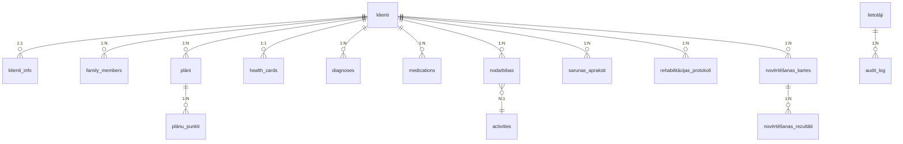

# Klientu Reģistrs - Datu Bāzes Shēmas Dokumentācija

**Versija:** 2.1.0  
**Statuss:** PRODUKCIJAS GATAVS  
**Datu bāzes versija:** v5.0  
**Izstrādātājs:** Dāvis Strazds  

---

## SATURA RĀDĪTĀJS

1. [DATU BĀZES PĀRSKATS](#1-datu-bāzes-pārskats)
2. [TABULU STRUKTŪRA](#2-tabulu-struktūra)
3. [ENTĪTIJU ATTIECĪBAS](#3-entītiju-attiecības)
4. [INDEKSI UN OPTIMIZĀCIJA](#4-indeksi-un-optimizācija)
5. [DATU TIPU DEFINĪCIJAS](#5-datu-tipu-definīcijas)
6. [TRIGERI UN IEROBEJUMI](#6-triggeri-un-ierobežojumi)
7. [MIGRĀCIJAS SKRIPTI](#7-migrācijas-skripti)
8. [REZERVES KOPIJU STRATĒGIJA](#8-rezerves-kopiju-stratēgija)
9. [PERFORMANCE REKOMENDĀCIJAS](#9-performance-rekomendācijas)
10. [DROŠĪBAS KONFIGURĀCIJA](#10-drošības-konfigurācija)

---

## 1. DATU BĀZES PĀRSKATS

### 1.1. Datu bāzes informācija

**Datu bāzes nosaukums:** `socialcare_db`  
**Kolācijas rakstzība:** `utf8mb4`  
**Kolācijas kārtojums:** `utf8mb4_unicode_ci`  
**Datu bāzes dzinis:** `InnoDB`  

**Atbalstītās MySQL versijas:**
- MySQL 8.0+
- MariaDB 10.5+
- Percona Server 8.0+

### 1.2. Shēmas versiju vadība

**Versiju kontrole tabula:**
```sql
CREATE TABLE configuration (
    config_key VARCHAR(100) PRIMARY KEY,
    config_value TEXT,
    description TEXT,
    updated_at TIMESTAMP DEFAULT CURRENT_TIMESTAMP ON UPDATE CURRENT_TIMESTAMP
);

INSERT INTO configuration (config_key, config_value, description) 
VALUES ('db_version', '5.0', 'Datubāzes shēmas versija');
```

### 1.3. Galvenie principi

- **Normalizācija:** Līdz 3NF (Third Normal Form)
- **Integritāte:** Ārējās un atsauces integritāte
- **ACID atbilstība:** Transakciju atbalsts
- **Indeksēšana:** Optimizēti indeksi veiktspējai
- **Audit:** Pilna darbību žurnalēšana

---

## 2. TABULU STRUKTŪRA

### 2.1. Klientu pamattabulas

#### 2.1.1. klienti

```sql
CREATE TABLE klienti (
    id INT AUTO_INCREMENT PRIMARY KEY,
    personas_kods VARCHAR(32) UNIQUE NOT NULL,
    vards VARCHAR(100) NOT NULL,
    uzvards VARCHAR(100) NOT NULL,
    dzimšanas_datums DATE NOT NULL,
    dzimšanas_vieta VARCHAR(100),
    statuss ENUM('AKTĪVS', 'IZRAKSTĪTS', 'MIRIS') DEFAULT 'AKTĪVS',
    iestāšanas_datums DATE NOT NULL,
    aiziešanas_datums DATE NULL,
    adrese TEXT,
    telefons VARCHAR(20),
    epasts VARCHAR(100),
    izveidots TIMESTAMP DEFAULT CURRENT_TIMESTAMP,
    labots TIMESTAMP DEFAULT CURRENT_TIMESTAMP ON UPDATE CURRENT_TIMESTAMP,
    laboja_lietotajs VARCHAR(50),
    
    INDEX idx_personas_kods (personas_kods),
    INDEX idx_statuss (statuss),
    INDEX idx_vards_uzvards (vards, uzvards),
    INDEX idx_istāšanas_datums (iestāšanas_datums)
) ENGINE=InnoDB DEFAULT CHARSET=utf8mb4 COLLATE=utf8mb4_unicode_ci;
```

#### 2.1.2. klienti_info

```sql
CREATE TABLE klienti_info (
    klienta_id INT PRIMARY KEY,
    izglītība VARCHAR(100),
    profesija VARCHAR(100),
    valodas TEXT,
    intereses TEXT,
    ieradumi TEXT,
    sociālā_situācija TEXT,
    dzīvesvietas TEXT,
    ģimenes_stāvoklis TEXT,
    izveidots TIMESTAMP DEFAULT CURRENT_TIMESTAMP,
    labots TIMESTAMP DEFAULT CURRENT_TIMESTAMP ON UPDATE CURRENT_TIMESTAMP,
    
    FOREIGN KEY (klienta_id) REFERENCES klienti(id) ON DELETE CASCADE
) ENGINE=InnoDB DEFAULT CHARSET=utf8mb4 COLLATE=utf8mb4_unicode_ci;
```

#### 2.1.3. family_members

```sql
CREATE TABLE family_members (
    id INT AUTO_INCREMENT PRIMARY KEY,
    klienta_id INT NOT NULL,
    vards VARCHAR(100) NOT NULL,
    uzvards VARCHAR(100) NOT NULL,
    radzība ENUM('DĒLS', 'MEITA', 'MĀTE', 'TĒV', 'VECĀKMĀTE', 'OTHER') NOT NULL,
    personas_kods VARCHAR(32),
    telefons VARCHAR(20),
    epasts VARCHAR(100),
    adrese TEXT,
    ir_tiesības_apmeklēt BOOLEAN DEFAULT FALSE,
    piezīmes TEXT,
    izveidots TIMESTAMP DEFAULT CURRENT_TIMESTAMP,
    labots TIMESTAMP DEFAULT CURRENT_TIMESTAMP ON UPDATE CURRENT_TIMESTAMP,
    
    FOREIGN KEY (klienta_id) REFERENCES klienti(id) ON DELETE CASCADE,
    INDEX idx_klienta_id (klienta_id),
    INDEX idx_personas_kods (personas_kods)
) ENGINE=InnoDB DEFAULT CHARSET=utf8mb4 COLLATE=utf8mb4_unicode_ci;
```

### 2.2. Plānu un rehabilitācijas tabulas

#### 2.2.1. plāni

```sql
CREATE TABLE plāni (
    id INT AUTO_INCREMENT PRIMARY KEY,
    klienta_id INT NOT NULL,
    plana_veids ENUM('APRŪPE', 'REHABILITĀCIJA') NOT NULL,
    sākuma_datums DATE NOT NULL,
    beigu_datums DATE,
    statuss ENUM('AKTĪVS', 'BEIGTS', 'PAUZĒTS') DEFAULT 'AKTĪVS',
    mērķi TEXT,
    atbildīgais VARCHAR(100),
    izveidots TIMESTAMP DEFAULT CURRENT_TIMESTAMP,
    labots TIMESTAMP DEFAULT CURRENT_TIMESTAMP ON UPDATE CURRENT_TIMESTAMP,
    laboja_lietotajs VARCHAR(50),
    
    FOREIGN KEY (klienta_id) REFERENCES klienti(id) ON DELETE CASCADE,
    INDEX idx_klienta_veids_status (klienta_id, plana_veids, statuss),
    INDEX idx_datumi (sākuma_datums, beigu_datums)
) ENGINE=InnoDB DEFAULT CHARSET=utf8mb4 COLLATE=utf8mb4_unicode_ci;
```

#### 2.2.2. plānu_punkti

```sql
CREATE TABLE plānu_punkti (
    id INT AUTO_INCREMENT PRIMARY KEY,
    plāna_id INT NOT NULL,
    rindas_nr INT NOT NULL,
    mērķis TEXT NOT NULL,
    darbības TEXT,
    atbildīgais VARCHAR(100),
    termiņš DATE,
    statuss ENUM('PLĀNOTS', 'PROGRESĀ', 'PABEIGTS') DEFAULT 'PLĀNOTS',
    rezultāts TEXT,
    izveidots TIMESTAMP DEFAULT CURRENT_TIMESTAMP,
    labots TIMESTAMP DEFAULT CURRENT_TIMESTAMP ON UPDATE CURRENT_TIMESTAMP,
    
    FOREIGN KEY (plāna_id) REFERENCES plāni(id) ON DELETE CASCADE,
    UNIQUE KEY uk_plāna_rinda (plāna_id, rindas_nr),
    INDEX idx_plāna_status (plāna_id, statuss)
) ENGINE=InnoDB DEFAULT CHARSET=utf8mb4 COLLATE=utf8mb4_unicode_ci;
```

### 2.3. Medicīniskās tabulas

#### 2.3.1. health_cards

```sql
CREATE TABLE health_cards (
    id INT AUTO_INCREMENT PRIMARY KEY,
    klienta_id INT NOT NULL,
    anamnēze TEXT,
    alerģijas TEXT,
    iepriekšējās_hospitalizācijas TEXT,
    ģimenes_anamnēze TEXT,
    izveidots TIMESTAMP DEFAULT CURRENT_TIMESTAMP,
    labots TIMESTAMP DEFAULT CURRENT_TIMESTAMP ON UPDATE CURRENT_TIMESTAMP,
    laboja_lietotajs VARCHAR(50),
    
    FOREIGN KEY (klienta_id) REFERENCES klienti(id) ON DELETE CASCADE
) ENGINE=InnoDB DEFAULT CHARSET=utf8mb4 COLLATE=utf8mb4_unicode_ci;
```

#### 2.3.2. diagnoses

```sql
CREATE TABLE diagnoses (
    id INT AUTO_INCREMENT PRIMARY KEY,
    klienta_id INT NOT NULL,
    mk10_kods VARCHAR(10) NOT NULL,
    nosaukums VARCHAR(200) NOT NULL,
    tips ENUM('GALVENĀ', 'PAPILDUS') DEFAULT 'GALVENĀ',
    diagnozes_datums DATE NOT NULL,
    ārsts VARCHAR(100),
    izveidots TIMESTAMP DEFAULT CURRENT_TIMESTAMP,
    labots TIMESTAMP DEFAULT CURRENT_TIMESTAMP ON UPDATE CURRENT_TIMESTAMP,
    
    FOREIGN KEY (klienta_id) REFERENCES klienti(id) ON DELETE CASCADE,
    INDEX idx_klienta_mk10 (klienta_id, mk10_kods),
    INDEX idx_mk10_kods (mk10_kods)
) ENGINE=InnoDB DEFAULT CHARSET=utf8mb4 COLLATE=utf8mb4_unicode_ci;
```

#### 2.3.3. medications

```sql
CREATE TABLE medications (
    id INT AUTO_INCREMENT PRIMARY KEY,
    klienta_id INT NOT NULL,
    medikamenta_nosaukums VARCHAR(200) NOT NULL,
    deva VARCHAR(50) NOT NULL,
    forma VARCHAR(50),
    biežums VARCHAR(50),
    sākuma_datums DATE NOT NULL,
    beigu_datums DATE,
    norīkojums TEXT,
    izveidots TIMESTAMP DEFAULT CURRENT_TIMESTAMP,
    labots TIMESTAMP DEFAULT CURRENT_TIMESTAMP ON UPDATE CURRENT_TIMESTAMP,
    
    FOREIGN KEY (klienta_id) REFERENCES klienti(id) ON DELETE CASCADE,
    INDEX idx_klienta_medikamenta (klienta_id, medikamenta_nosaukums),
    INDEX idx_datumi (sākuma_datums, beigu_datums)
) ENGINE=InnoDB DEFAULT CHARSET=utf8mb4 COLLATE=utf8mb4_unicode_ci;
```

### 2.4. Nodarbību tabulas

#### 2.4.1. nodarbibas

```sql
CREATE TABLE nodarbibas (
    id INT AUTO_INCREMENT PRIMARY KEY,
    datums DATE NOT NULL,
    laiks TIME NOT NULL,
    klienta_id INT NOT NULL,
    nodarbības_veids VARCHAR(100) NOT NULL,
    speciālists VARCHAR(100),
    apraksts TEXT NOT NULL,
    ilgums_minūtēs INT,
    klienta_reakcija TEXT,
    izveidots TIMESTAMP DEFAULT CURRENT_TIMESTAMP,
    labots TIMESTAMP DEFAULT CURRENT_TIMESTAMP ON UPDATE CURRENT_TIMESTAMP,
    laboja_lietotajs VARCHAR(50),
    
    FOREIGN KEY (klienta_id) REFERENCES klienti(id) ON DELETE CASCADE,
    INDEX idx_klienta_datums (klienta_id, datums),
    INDEX idx_datums_veids (datums, nodarbības_veids)
) ENGINE=InnoDB DEFAULT CHARSET=utf8mb4 COLLATE=utf8mb4_unicode_ci;
```

#### 2.4.2. activities

```sql
CREATE TABLE activities (
    id INT AUTO_INCREMENT PRIMARY KEY,
    nosaukums VARCHAR(200) NOT NULL,
    bloks VARCHAR(50) NOT NULL,
    speciālists VARCHAR(100),
    joma VARCHAR(100),
    līmenis VARCHAR(50),
    apraksts TEXT,
    aktīvs BOOLEAN DEFAULT TRUE,
    izveidots TIMESTAMP DEFAULT CURRENT_TIMESTAMP,
    labots TIMESTAMP DEFAULT CURRENT_TIMESTAMP ON UPDATE CURRENT_TIMESTAMP,
    
    INDEX idx_bloks_speciālists (bloks, speciālists),
    INDEX idx_joma_līmenis (joma, līmenis),
    INDEX idx_aktīvs (aktīvs)
) ENGINE=InnoDB DEFAULT CHARSET=utf8mb4 COLLATE=utf8mb4_unicode_ci;
```

### 2.5. Sarunu un protokolu tabulas

#### 2.5.1. sarunas_apraksti

```sql
CREATE TABLE sarunas_apraksti (
    id INT AUTO_INCREMENT PRIMARY KEY,
    datums DATE NOT NULL,
    laiks TIME NOT NULL,
    klienta_id INT NOT NULL,
    veids ENUM('INDIVIDUĀLA', 'GRUPA', 'ĢIMENE') DEFAULT 'INDIVIDUĀLA',
    dalībnieki TEXT,
    tēma VARCHAR(200) NOT NULL,
    saturs TEXT NOT NULL,
    secinājumi TEXT,
    turpmājie_pasākumi TEXT,
    izveidots TIMESTAMP DEFAULT CURRENT_TIMESTAMP,
    labots TIMESTAMP DEFAULT CURRENT_TIMESTAMP ON UPDATE CURRENT_TIMESTAMP,
    laboja_lietotajs VARCHAR(50),
    
    FOREIGN KEY (klienta_id) REFERENCES klienti(id) ON DELETE CASCADE,
    INDEX idx_klienta_datums (klienta_id, datums),
    INDEX idx_veids (veids)
) ENGINE=InnoDB DEFAULT CHARSET=utf8mb4 COLLATE=utf8mb4_unicode_ci;
```

#### 2.5.2. rehabilitācijas_protokoli

```sql
CREATE TABLE rehabilitācijas_protokoli (
    id INT AUTO_INCREMENT PRIMARY KEY,
    numurs VARCHAR(50) UNIQUE NOT NULL,
    datums DATE NOT NULL,
    klienta_id INT NOT NULL,
    komanda TEXT,
    mērķi TEXT,
    plāns TEXT,
    atbildīgās_personas TEXT,
    izveidots TIMESTAMP DEFAULT CURRENT_TIMESTAMP,
    labots TIMESTAMP DEFAULT CURRENT_TIMESTAMP ON UPDATE CURRENT_TIMESTAMP,
    laboja_lietotajs VARCHAR(50),
    
    FOREIGN KEY (klienta_id) REFERENCES klienti(id) ON DELETE CASCADE,
    INDEX idx_klienta_datums (klienta_id, datums),
    INDEX idx_numurs (numurs)
) ENGINE=InnoDB DEFAULT CHARSET=utf8mb4 COLLATE=utf8mb4_unicode_ci;
```

### 2.6. Novērtēšanas tabulas

#### 2.6.1. novērtēšanas_kartes

```sql
CREATE TABLE novērtēšanas_kartes (
    id INT AUTO_INCREMENT PRIMARY KEY,
    klienta_id INT NOT NULL,
    veids ENUM('BĀZES', 'DINAMIKAS') NOT NULL,
    datums DATE NOT NULL,
    novērtētājs VARCHAR(100) NOT NULL,
    izveidots TIMESTAMP DEFAULT CURRENT_TIMESTAMP,
    labots TIMESTAMP DEFAULT CURRENT_TIMESTAMP ON UPDATE CURRENT_TIMESTAMP,
    laboja_lietotajs VARCHAR(50),
    
    FOREIGN KEY (klienta_id) REFERENCES klienti(id) ON DELETE CASCADE,
    INDEX idx_klienta_veids_datums (klienta_id, veids, datums)
) ENGINE=InnoDB DEFAULT CHARSET=utf8mb4 COLLATE=utf8mb4_unicode_ci;
```

#### 2.6.2. novērtēšanas_rezultāti

```sql
CREATE TABLE novērtēšanas_rezultāti (
    id INT AUTO_INCREMENT PRIMARY KEY,
    karte_id INT NOT NULL,
    kategorija VARCHAR(50) NOT NULL,
    uzdevums VARCHAR(200) NOT NULL,
    punkti INT NOT NULL,
    maksimāli_punkti INT NOT NULL DEFAULT 15,
    izveidots TIMESTAMP DEFAULT CURRENT_TIMESTAMP,
    labots TIMESTAMP DEFAULT CURRENT_TIMESTAMP ON UPDATE CURRENT_TIMESTAMP,
    
    FOREIGN KEY (karte_id) REFERENCES novērtēšanas_kartes(id) ON DELETE CASCADE,
    INDEX idx_karte_kategorija (karte_id, kategorija)
) ENGINE=InnoDB DEFAULT CHARSET=utf8mb4 COLLATE=utf8mb4_unicode_ci;
```

### 2.7. Sistēmas un konfigurācijas tabulas

#### 2.7.1. lietotāji

```sql
CREATE TABLE lietotāji (
    id INT AUTO_INCREMENT PRIMARY KEY,
    lietotājvārds VARCHAR(50) UNIQUE NOT NULL,
    parole_hash VARCHAR(255) NOT NULL,
    sāls VARCHAR(128),
    pilns_vārds VARCHAR(200),
    epasts VARCHAR(100),
    loma ENUM('ADMIN', 'MANAGER', 'USER', 'MEDIC') DEFAULT 'USER',
    statuss ENUM('AKTĪVS', 'DEAKTIVĒTS', 'BLOĶĒTS') DEFAULT 'AKTĪVS',
    pēdējā_pieteikšanās TIMESTAMP,
    pēdējā_aktivitāte TIMESTAMP,
    izveidots TIMESTAMP DEFAULT CURRENT_TIMESTAMP,
    labots TIMESTAMP DEFAULT CURRENT_TIMESTAMP ON UPDATE CURRENT_TIMESTAMP,
    
    INDEX idx_lietotājvārds (lietotājvārds),
    INDEX idx_loma_statuss (loma, statuss)
) ENGINE=InnoDB DEFAULT CHARSET=utf8mb4 COLLATE=utf8mb4_unicode_ci;
```

#### 2.7.2. audit_log

```sql
CREATE TABLE audit_log (
    id BIGINT AUTO_INCREMENT PRIMARY KEY,
    lietotāja_id INT,
    lietotājvārds VARCHAR(50),
    darbība VARCHAR(50) NOT NULL,
    entītija VARCHAR(50),
    entītijas_id INT,
    ip_adrese VARCHAR(45),
    lietotāja_aģents TEXT,
    detaļas TEXT,
    laikspiedzegums TIMESTAMP DEFAULT CURRENT_TIMESTAMP,
    
    INDEX idx_lietotāja_laiks (lietotāja_id, laikspiedzegums),
    INDEX idx_darbība_laiks (darbība, laikspiedzegums),
    INDEX idx_entītija_laiks (entītija, laikspiedzegums)
) ENGINE=InnoDB DEFAULT CHARSET=utf8mb4 COLLATE=utf8mb4_unicode_ci;
```

#### 2.7.3. configuration

```sql
CREATE TABLE configuration (
    config_key VARCHAR(100) PRIMARY KEY,
    config_value TEXT,
    description TEXT,
    updated_at TIMESTAMP DEFAULT CURRENT_TIMESTAMP ON UPDATE CURRENT_TIMESTAMP
) ENGINE=InnoDB DEFAULT CHARSET=utf8mb4 COLLATE=utf8mb4_unicode_ci;
```

---

## 3. ENTĪTIJU ATTIECĪBAS

### 3.1. ERD diagramma (Entity Relationship Diagram)



### 3.2. Attiecību apraksti

#### 3.2.1. Klienta entītija

**Klients (1) → Klienta informācija (1)**
- Katram klientam ir tieši viena paplašinātā informācijas ieraksts
- CASCADE dzēšana - dzēšot klientu, tiek dzēsta arī paplašinātā informācija

**Klients (1) → Piederīgie (N)**
- Klientam var būt vairāki piederīgie
- Piederīgajam ir radzības un kontakttinformācija
- CASCADE dzēšana - dzēšot klientu, tiek dzēsti visi piederīgie

**Klients (1) → Plāni (N)**
- Klientam var būt vairāki plāni (aprūpes un rehabilitācijas)
- Plāni ir laika ierobežoti (sākuma/beigu datumi)
- CASCADE dzēšana - dzēšot klientu, tiek dzēsti visi plāni

#### 3.2.2. Plānu entītija

**Plāns (1) → Plāna punkti (N)**
- Katram plānam ir vairāki punkti
- Punkti ir secīgi numurēti
- CASCADE dzēšana - dzēšot plānu, tiek dzēsti visi punkti

#### 3.2.3. Medicīniskās entītijas

**Klients (1) → Veselības karte (1)**
- Katram klientam ir viena veselības karte
- Satur anamnēzi un citu medicīnisko informāciju

**Klients (1) → Diagnozes (N)**
- Klientam var būt vairākas diagnozes
- Katrai diagnozei ir MK-10 kods un tips

**Klients (1) → Medikamenti (N)**
- Klientam var būt vairāki medikamenti
- Medikamentiem ir sākuma/beigu datumi un devas informācija

---

## 4. INDEKSI UN OPTIMIZĀCIJA

### 4.1. Galvenie indeksi

```sql
-- Klientu meklēšanas optimizācija
CREATE INDEX idx_klienti_search ON klienti(vards, uzvards, personas_kods, statuss);
CREATE INDEX idx_klienti_istāšanas_dati ON klienti(istāšanas_datums, statuss);

-- Plānu optimizācija
CREATE INDEX idx_plāni_klients_veids ON plāni(klienta_id, plana_veids, statuss);
CREATE INDEX idx_plāni_datumi ON plāni(sākuma_datums, beigu_datums);

-- Nodarbību optimizācija
CREATE INDEX idx_nodarbibas_klients_datums ON nodarbibas(klienta_id, datums);
CREATE INDEX idx_nodarbibas_datums_veids ON nodarbibas(datums, nodarbības_veids);

-- Medicīnisko datu optimizācija
CREATE INDEX idx_diagnoses_klients_mk10 ON diagnoses(klienta_id, mk10_kods);
CREATE INDEX idx_medications_klients_datums ON medications(klienta_id, sākuma_datums);

-- Audit žurnāla optimizācija
CREATE INDEX idx_audit_lietotājs_laiks ON audit_log(lietotāja_id, laikspiedzegums);
CREATE INDEX idx_audit_darbība_laiks ON audit_log(darbība, laikspiedzegums);
```

### 4.2. Indeksu stratēģija

#### 4.2.1. Bieži lietoti indeksi

1. **Primārie atslēgas (Primary Keys)**
   - Visām tabulām ir AUTO_INCREMENT primārās atslēgas
   - Nodrošina unikālu identifikāciju

2. **Unikālie indeksi (Unique Indexes)**
   - `personas_kods` klientu tabulā
   - `lietotājvārds` lietotāju tabulā
   - `numurs` rehabilitācijas protokolu tabulā

3. **Savienojuma indeksi (Composite Indexes)**
   - `(klienta_id, plana_veids, statuss)` plānu tabulā
   - `(vards, uzvards, personas_kods)` klientu meklēšanai
   - `(datums, nodarbības_veids)` nodarbību filtrēšanai

#### 4.2.2. Indeksu uzturēšana

```sql
-- Indeksu analīze
ANALYZE TABLE klienti;
ANALYZE TABLE plāni;
ANALYZE TABLE nodarbibas;

-- Indeksu pārbūve
SHOW INDEX FROM klienti;
SHOW INDEX FROM plāni;

-- Nederīgo indeksu dzēšana
DROP INDEX idx_unused_index ON table_name;
```

### 4.3. Query optimizācija

#### 4.3.1. Klienta meklēšana

```sql
-- Optimizēts meklēšanas vaicājums
SELECT k.id, k.vards, k.uzvards, k.personas_kods, k.statuss, k.istāšanas_datums
FROM klienti k
WHERE (k.vards LIKE ? OR k.uzvards LIKE ? OR k.personas_kods = ?)
  AND k.statuss = ?
ORDER BY k.uzvards, k.vards
LIMIT ? OFFSET ?;
```

#### 4.3.2. Plānu statistika

```sql
-- Plānu statistika ar optimizētu JOIN
SELECT 
    p.plana_veids,
    COUNT(*) as skaits,
    COUNT(CASE WHEN p.statuss = 'AKTĪVS' THEN 1 END) as aktīvi,
    COUNT(CASE WHEN p.statuss = 'BEIGTS' THEN 1 END) as beigti
FROM plāni p
WHERE p.sākuma_datums BETWEEN ? AND ?
GROUP BY p.plana_veids;
```

---

## 5. DATU TIPU DEFINĪCIJAS

### 5.1. String tipi

#### 5.1.1. VARCHAR garumi

| Lauks | Tips | Garums | Iemesls |
|-------|------|--------|---------|
| vards, uzvards | VARCHAR | 100 | Pārsvarīgi lieli vārdi reti |
| personas_kods | VARCHAR | 32 | Precīzs formāts (DDMMYY-XXXXX vai 32XXXXXXXXX) |
| epasts | VARCHAR | 100 | RFC 5322 standarta ierobežojums |
| telefons | VARCHAR | 20 | Starptautiskie formāti (+, -, (, )) |

#### 5.1.2. TEXT tipi

| Lauks | Tips | Iemesls |
|-------|------|---------|
| adrese | TEXT | Adreses var būt ļoti garas |
| apraksts | TEXT | Detalizēti apraksti bez fiksēta garuma |
| detaļas | TEXT | JSON vai XML datu glabāšana |

### 5.2. Datu un laika tipi

#### 5.2.1. DATE tipi

| Lauks | Tips | Formāts | Validācija |
|-------|------|---------|-------------|
| dzimšanas_datums | DATE | YYYY-MM-DD | Nevar būt nākotnē |
| istāšanas_datums | DATE | YYYY-MM-DD | Nevar būt pirms dzimšanas datuma |
| sākuma_datums | DATE | YYYY-MM-DD | Nevar būt pirms beigu datuma |

#### 5.2.2. TIMESTAMP tipi

| Lauks | Tips | Noklusējais | Iemesls |
|-------|------|-------------|---------|
| izveidots | TIMESTAMP | CURRENT_TIMESTAMP | Automātiska izveides laika zīmogošana |
| labots | TIMESTAMP | ON UPDATE CURRENT_TIMESTAMP | Automātiska labošanas laika zīmogošana |
| laikspiedzegums | TIMESTAMP | CURRENT_TIMESTAMP | Precīzs laika zīmogs |

### 5.3. ENUM tipi

#### 5.3.1. Statusu enumerācijas

```sql
-- Klienta statuss
ENUM('AKTĪVS', 'IZRAKSTĪTS', 'MIRIS')

-- Plānu statuss
ENUM('AKTĪVS', 'BEIGTS', 'PAUZĒTS')

-- Lomas
ENUM('ADMIN', 'MANAGER', 'USER', 'MEDIC')
```

### 5.4. BOOLEAN tipi

| Lauks | Tips | Noklusējums | Izmantojums |
|-------|------|-------------|-----------|
| aktīvs | BOOLEAN | TRUE | Aktivitātes statuss |
| ir_tiesības_apmeklēt | BOOLEAN | FALSE | Piekļuves tiesības |

---

## 6. TRIGGERI UN IEROBEJUMI

### 6.1. Audit žurnāla triggeri

#### 6.1.1. Klientu izmaiņu žurnalēšana

```sql
DELIMITER //

CREATE TRIGGER trg_klienti_audit_insert
AFTER INSERT ON klienti
FOR EACH ROW
BEGIN
    INSERT INTO audit_log (
        lietotāja_id,
        lietotājvārds,
        darbība,
        entītija,
        entītijas_id,
        detaļas
    ) VALUES (
        @current_user_id,
        @current_username,
        'INSERT',
        'klienti',
        NEW.id,
        CONCAT('Izveidots jauns klients: ', NEW.vards, ' ', NEW.uzvards)
    );
END//

CREATE TRIGGER trg_klienti_audit_update
AFTER UPDATE ON klienti
FOR EACH ROW
BEGIN
    INSERT INTO audit_log (
        lietotāja_id,
        lietotājvārds,
        darbība,
        entītija,
        entītijas_id,
        detaļas
    ) VALUES (
        @current_user_id,
        @current_username,
        'UPDATE',
        'klienti',
        NEW.id,
        CONCAT('Atjaunināts klients: ', NEW.vards, ' ', NEW.uzvards)
    );
END//

DELIMITER ;
```

### 6.2. Datu integritātes triggeri

#### 6.2.1. Statusa izmaiņu validācija

```sql
DELIMITER //

CREATE TRIGGER trg_klienti_status_validation
BEFORE UPDATE ON klienti
FOR EACH ROW
BEGIN
    -- Pārbauda, vai statusa izmaiņa ir atļauta
    IF OLD.statuss = 'MIRIS' AND NEW.statuss != 'MIRIS' THEN
        SIGNAL SQLSTATE '45000'
        SET MESSAGE_TEXT = 'Mirušu klientu statusu var mainīt tikai administrators';
    END IF;
    
    -- Pārbauda, vai aiziešanas datums nav pirms istāšanas datuma
    IF NEW.aiziešanas_datums IS NOT NULL 
       AND NEW.aiziešanas_datums < NEW.istāšanas_datums THEN
        SIGNAL SQLSTATE '45000'
        SET MESSAGE_TEXT = 'Aiziešanas datums nevar būt pirms istāšanas datuma';
    END IF;
END//

DELIMITER ;
```

### 6.3. Automātiskā laika atjaunināšana

#### 6.3.1. Pēdējās aktivitātes atjaunināšana

```sql
DELIMITER //

CREATE TRIGGER trg_lietotāji_activity_update
AFTER UPDATE ON lietotāji
FOR EACH ROW
BEGIN
    UPDATE lietotāji
    SET pēdējā_aktivitāte = CURRENT_TIMESTAMP
    WHERE id = NEW.id;
END//

DELIMITER ;
```

---

## 7. MIGRĀCIJAS SKRIPTI

### 7.1. Shēmas migrācija

#### 7.1.1. v4.0 → v5.0 migrācija

```sql
-- Migrācija: v4.0 uz v5.0
-- Izpildes laiks: 2024-01-15

-- 1. Jaunas kolonnas klientu tabulai
ALTER TABLE klienti 
ADD COLUMN laboja_lietotajs VARCHAR(50) AFTER labots;

-- 2. Jauna tabula: novērtēšanas kartes
CREATE TABLE novērtēšanas_kartes (
    id INT AUTO_INCREMENT PRIMARY KEY,
    klienta_id INT NOT NULL,
    veids ENUM('BĀZES', 'DINAMIKAS') NOT NULL,
    datums DATE NOT NULL,
    novērtētājs VARCHAR(100) NOT NULL,
    izveidots TIMESTAMP DEFAULT CURRENT_TIMESTAMP,
    labots TIMESTAMP DEFAULT CURRENT_TIMESTAMP ON UPDATE CURRENT_TIMESTAMP,
    laboja_lietotajs VARCHAR(50),
    
    FOREIGN KEY (klienta_id) REFERENCES klienti(id) ON DELETE CASCADE,
    INDEX idx_klienta_veids_datums (klienta_id, veids, datums)
) ENGINE=InnoDB DEFAULT CHARSET=utf8mb4 COLLATE=utf8mb4_unicode_ci;

-- 3. Jauna tabula: novērtēšanas rezultāti
CREATE TABLE novērtēšanas_rezultāti (
    id INT AUTO_INCREMENT PRIMARY KEY,
    karte_id INT NOT NULL,
    kategorija VARCHAR(50) NOT NULL,
    uzdevums VARCHAR(200) NOT NULL,
    punkti INT NOT NULL,
    maksimāli_punkti INT NOT NULL DEFAULT 15,
    izveidots TIMESTAMP DEFAULT CURRENT_TIMESTAMP,
    labots TIMESTAMP DEFAULT CURRENT_TIMESTAMP ON UPDATE CURRENT_TIMESTAMP,
    
    FOREIGN KEY (karte_id) REFERENCES novērtēšanas_kartes(id) ON DELETE CASCADE,
    INDEX idx_karte_kategorija (karte_id, kategorija)
) ENGINE=InnoDB DEFAULT CHARSET=utf8mb4 COLLATE=utf8mb4_unicode_ci;

-- 4. Datu migrācija no vecās struktūras
INSERT INTO novērtēšanas_kartes (klienta_id, veids, datums, novērtētājs)
SELECT 
    id,
    'BĀZES',
    datumu,
    novērtētājs
FROM vecas_novērtēšanas_kartes;

-- 5. Indeksu optimizācija
CREATE INDEX idx_klienti_search ON klienti(vards, uzvards, personas_kods, statuss);
CREATE INDEX idx_plāni_klients_veids ON plāni(klienta_id, plana_veids, statuss);

-- 6. Konfigurācijas atjaunināšana
UPDATE configuration 
SET config_value = '5.0', 
    updated_at = CURRENT_TIMESTAMP 
WHERE config_key = 'db_version';
```

### 7.2. Datu migrācija skripti

#### 7.2.1. Personas kodu migrācija

```sql
-- Personas kodu migrācija (32 → 11 ciparu formāts)
UPDATE klienti 
SET personas_kods = 
    CASE 
        WHEN LENGTH(personas_kods) = 12 AND SUBSTRING(personas_kods, 1, 2) = '32' THEN
            CONCAT(SUBSTRING(personas_kods, 3, 9), '-', SUBSTRING(personas_kods, 12, 1))
        ELSE personas_kods
    END
WHERE personas_kods LIKE '32%';
```

#### 7.2.2. Statusu migrācija

```sql
-- Statusu migrācija (vecie → jauni)
UPDATE klienti 
SET statuss = 
    CASE 
        WHEN statuss = 'ACTIVE' THEN 'AKTĪVS'
        WHEN statuss = 'INACTIVE' THEN 'IZRAKSTĪTS'
        WHEN statuss = 'DECEASED' THEN 'MIRIS'
        ELSE statuss
    END
WHERE statuss IN ('ACTIVE', 'INACTIVE', 'DECEASED');
```

---

## 8. REZERVES KOPIJU STRATĒGIJA

### 8.1. Pilnas rezerves kopijas skripts

```bash
#!/bin/bash
# Pilnas rezerves kopijas skripts
# Datums: $(date +%Y%m%d_%H%M%S)
BACKUP_FILE="socialcare_db_backup_$(date +%Y%m%d_%H%M%S).sql"

# Konfigurācija
DB_HOST="localhost"
DB_PORT="3306"
DB_NAME="socialcare_db"
DB_USER="backup_user"
DB_PASS="secure_password"

# Rezerves kopijas izveide
mysqldump \
    --host=$DB_HOST \
    --port=$DB_PORT \
    --user=$DB_USER \
    --password=$DB_PASS \
    --single-transaction \
    --routines \
    --triggers \
    --databases \
    $DB_NAME > $BACKUP_FILE

# Kompresēšana
gzip $BACKUP_FILE

echo "Rezerves kopija izveidota: ${BACKUP_FILE}.gz"
```

### 8.2. Diferenciālās rezerves kopijas skripts

```bash
#!/bin/bash
# Diferenciālās rezerves kopijas skripts
DB_NAME="socialcare_db"
BACKUP_FILE="socialcare_db_diff_$(date +%Y%m%d_%H%M%S).sql"

# Diferenciālās rezerves kopija
mysqldump \
    --host=localhost \
    --port=3306 \
    --user=backup_user \
    --password=secure_password \
    --single-transaction \
    --master-data=2 \
    --databases \
    $DB_NAME > $BACKUP_FILE

echo "Diferenciālā rezerves kopija izveidota: $BACKUP_FILE"
```

### 8.3. Atjaunošanas skripts

```bash
#!/bin/bash
# Datu bāzes atjaunošanas skripts
BACKUP_FILE=$1

if [ -z "$BACKUP_FILE" ]; then
    echo "Lūdzu norādiet rezerves kopijas faila nosaukumu"
    exit 1
fi

# Datubāzes atjaunošana
mysql \
    --host=localhost \
    --port=3306 \
    --user=root \
    --password=root_password \
    < $BACKUP_FILE

echo "Datubāze atjaunināta no: $BACKUP_FILE"
```

---

## 9. PERFORMANCE REKOMENDĀCIJAS

### 9.1. Query optimizācija

#### 9.1.1. SELECT optimizācija

```sql
-- Sliktais piemērs - SELECT *
SELECT * FROM klienti WHERE vards LIKE '%jānis%';

-- Labais piemērs - SELECT tik nepieciešamās kolonnas
SELECT id, vards, uzvards, personas_kods, statuss 
FROM klienti 
WHERE vards LIKE 'jānis%' 
ORDER BY uzvards;
```

#### 9.1.2. JOIN optimizācija

```sql
-- Sliktais piemērs - bez indeksa
SELECT k.vards, COUNT(n.id) as nodarbību_skaits
FROM klienti k
LEFT JOIN nodarbibas n ON k.id = n.klienta_id
GROUP BY k.id;

-- Labais piemērs - ar indeksu
SELECT k.id, k.vards, COUNT(n.id) as nodarbību_skaits
FROM klienti k
LEFT JOIN nodarbibas n ON k.id = n.klienta_id
GROUP BY k.id, k.vards
ORDER BY nodarbību_skaits DESC;
```

### 9.2. Indeksu stratēģija

#### 9.2.1. Kardinalitātes problēmas

```sql
-- Problēma: SELECT ar funkciju uz indeksētu kolonnu
SELECT * FROM klienti WHERE YEAR(istāšanas_datums) = 2024;

-- Risinājums: aprēķināts indekss
ALTER TABLE klienti ADD INDEX idx_istāšanas_gads (YEAR(istāšanas_datums));

-- Vēlāks: priekšaprēķināts gads
SELECT * FROM klienti 
WHERE istāšanas_datums >= '2024-01-01' 
  AND istāšanas_datums < '2025-01-01';
```

### 9.3. Konfigurācijas optimizācija

#### 9.3.1. MySQL konfigurācija

```ini
[mysqld]
# InnoDB konfigurācija
innodb_buffer_pool_size = 2G
innodb_log_file_size = 256M
innodb_flush_log_at_trx_commit = 1
innodb_flush_method = O_DIRECT

# Query cache
query_cache_type = 1
query_cache_size = 256M

# Connection settings
max_connections = 200
max_allowed_packet = 64M
```

#### 9.3.2. InnoDB specifiskie iestatījumi

```sql
-- InnoDB buferu iestatījumi
SET GLOBAL innodb_buffer_pool_size = 2147483648;  -- 2GB
SET GLOBAL innodb_log_buffer_size = 67108864;      -- 64MB
SET GLOBAL innodb_flush_log_at_trx_commit = 1;

-- Ierobežojumu palielināšana
SET GLOBAL max_allowed_packet = 67108864;  -- 64MB
SET GLOBAL innodb_lock_wait_timeout = 50;
```

---

## 10. DROŠĪBAS KONFIGURĀCIJA

### 10.1. Lietotāju tiesības

#### 10.1.1. Lomu definīcijas

| Loma | Tiesības | Apraksts |
|------|----------|---------|
| ADMIN | Pilna piekļuve | Visas sistēmas funkcijas |
| MANAGER | Pārvaldība | Klientu pārvaldība, atskaites |
| USER | Pamata piekļuve | Sava klientu datu |
| MEDIC | Medicīniskā piekļuve | Veselības dati, medikamenti |

#### 10.1.2. SQL drošība

```sql
-- GRANT piešķu lietotājiem
GRANT SELECT, INSERT, UPDATE, DELETE ON socialcare_db.* TO 'app_user'@'%';

-- Tikai lasīšanas tiesības
GRANT SELECT ON socialcare_db.* TO 'readonly_user'@'%';

-- Specifiskas tiesības
GRANT SELECT, INSERT, UPDATE ON klienti TO 'social_worker'@'%';
GRANT SELECT ON diagnoses TO 'medical_staff'@'%';
```

### 10.2. Datu šifrēšana

#### 10.2.1. Sensitive datu aizsardzība

```sql
-- Pārbaude, vai ir šifrētas kolonnas
SELECT TABLE_NAME, COLUMN_NAME, ENCRYPTION
FROM information_schema.COLUMNS 
WHERE TABLE_SCHEMA = 'socialcare_db'
  AND ENCRYPTION != 'NONE';

-- Kolonnu šifrēšana (MySQL 8.0+)
ALTER TABLE klienti 
MODIFY COLUMN epasts VARCHAR(100) ENCRYPTED;
```

### 10.3. Audit žurnāls

#### 10.3.1. Pilna darbību žurnalēšana

```sql
-- Audit žurnāla apskate
SELECT 
    lietotājvārds,
    darbība,
    entītija,
    laikspiedzegums,
    detaļas
FROM audit_log 
WHERE laikspiedzegzus >= DATE_SUB(NOW(), INTERVAL 1 DAY)
ORDER BY laikspiedzegzus DESC;
```

---

## PIELIKUMI

### Pielikums A: Datu bāzes izveides skripts

```sql
-- Datu bāzes izveides skripts
CREATE DATABASE IF NOT EXISTS socialcare_db 
CHARACTER SET utf8mb4 
COLLATE utf8mb4_unicode_ci;

USE socialcare_db;

-- Tabulu izveide
SOURCE create_tables.sql;

-- Sākotnējie dati
SOURCE initial_data.sql;
```

### Pielikums B: Performance monitoringa vaicājumi

```sql
-- Lēno vaicājumi
SELECT 
    SCHEMA_NAME as 'Datubāze',
    TABLE_NAME as 'Tabula',
    TABLE_ROWS as 'Ieraksti',
    DATA_LENGTH as 'Datu izmērs (B)',
    INDEX_LENGTH as 'Indeksu izmērs (B)',
    (DATA_LENGTH + INDEX_LENGTH) as 'Kopējais izmērs (B)'
FROM information_schema.TABLES 
WHERE TABLE_SCHEMA = 'socialcare_db'
ORDER BY (DATA_LENGTH + INDEX_LENGTH) DESC;

-- Vaicājumi par indeksiem
SELECT 
    TABLE_NAME,
    INDEX_NAME,
    SEQ_IN_INDEX,
    COLUMN_NAME,
    CARDINALITY
FROM information_schema.STATISTICS 
WHERE TABLE_SCHEMA = 'socialcare_db'
ORDER BY TABLE_NAME, SEQ_IN_INDEX;
```

### Pielikums C: Datu tīrīšanas skripti

```sql
-- Vecu audit žurnāla tīrīšana (vecāki par 1 gadu)
DELETE FROM audit_log 
WHERE laikspiedzegzus < DATE_SUB(NOW(), INTERVAL 1 YEAR);

-- Neaktīvo lietotāju dzēšana
DELETE FROM lietotāji 
WHERE statuss = 'DEAKTIVĒTS' 
  AND pēdējā_aktivitāte < DATE_SUB(NOW(), INTERVAL 2 YEAR);
```

---

**Dokumenta beigas**

© 2024 Dāvis Strazds. Visas tiesības aizsargātas.

Šī datu bāzes shēmas dokumentācija ir paredzēta datubāzes administratoriem un izstrādātājiem. Tās izplatīšana bez atļaujas ir aizliegta.

*Pēdējoreiz atjaunināts: 2024. gada 15. janvārī*
